# Performance history for `copilot-create-issue.md`

## Run, job & step times (`main`, using inference)

**63 successful runs.** Regressions shown below are limited to the last six weeks.

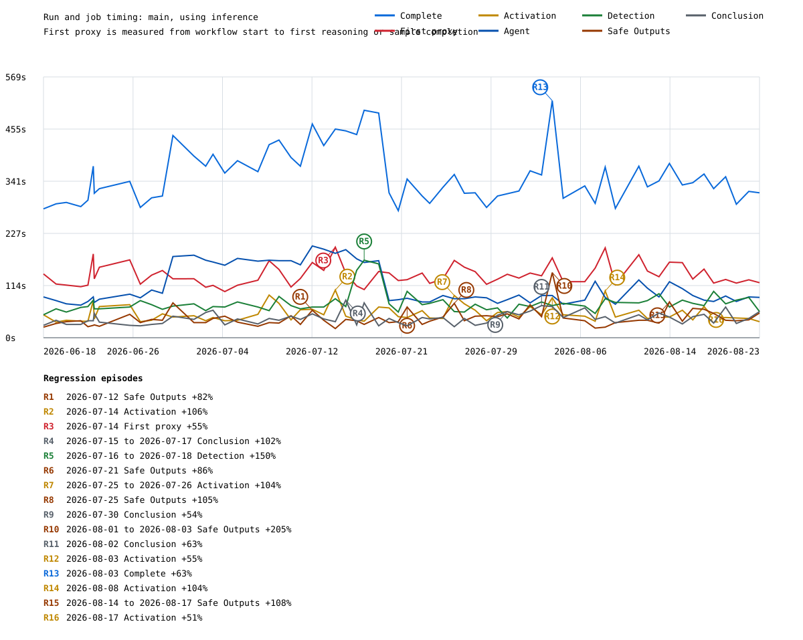

| Run or job | Samples | Median | P90 |
|---|---:|---:|---:|
| Workflow complete | 63 | 338.0s | 442.6s |
| Workflow start to proxy step | 63 | 109.0s | 147.8s |
| Proxy step to first reasoning/sample | 63 | 21.0s | 27.5s |
| Job `activation` | 63 | 46.0s | 74.8s |
| Job `agent` | 63 | 91.0s | 172.8s |
| Job `detection` | 63 | 70.0s | 89.6s |
| Job `safe_outputs` | 63 | 38.0s | 63.6s |
| Job `conclusion` | 63 | 41.0s | 59.6s |
| Major step `Execute GitHub Copilot CLI` | 63 | 29.0s | 114.0s |
| Major step `Set up job` | 63 | 17.0s | 21.8s |
| Major step `Install ripgrep` | 6 | 14.0s | 19.0s |
| Major step `Download container images` | 63 | 11.0s | 18.8s |
| Major step `Start MCP Gateway` | 63 | 7.0s | 11.0s |
| Major step `Install GitHub Copilot CLI` | 63 | 4.0s | 6.8s |
| Major step `Setup Scripts` | 62 | 3.0s | 5.0s |
| Major step `Download activation artifact` | 34 | 2.0s | 2.0s |
| Major step `Upload agent artifacts` | 23 | 2.0s | 2.0s |
| Major step `Checkout repository` | 14 | 2.0s | 2.0s |
| Major step `Install AWF binary` | 4 | 2.0s | 2.0s |
| Major step `Stop MCP Gateway` | 9 | 2.0s | 2.0s |
| Major step `Print firewall logs` | 1 | 2.0s | 2.0s |
| Major step `Audit pre-agent workspace` | 1 | 2.0s | 2.0s |

### Major step times for job `activation` (`main`, using inference)

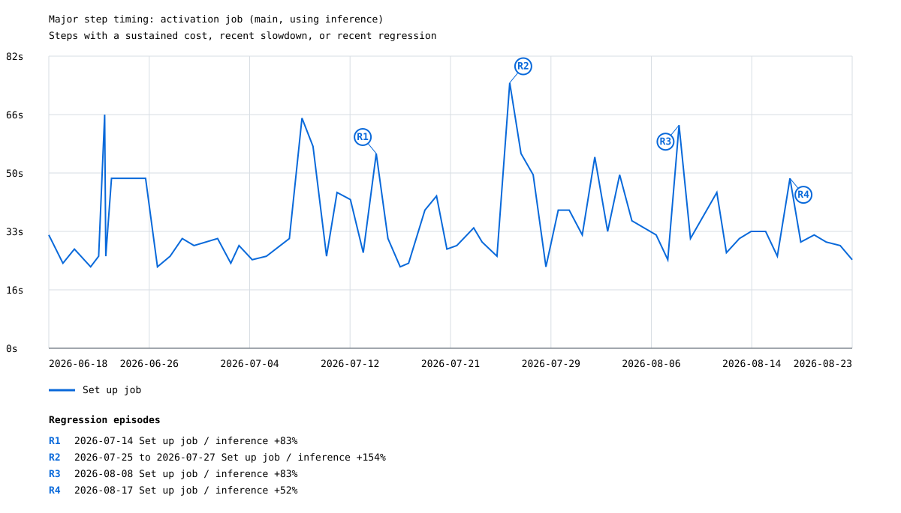

#### Candidate regressions (last six weeks)

| Label | Episode | Step | Peak | Prior median | Increase | Run | gh-aw version / commit |
|---|---|---|---:|---:|---:|---|---|
| R1 | 2026-07-14 | Set up job | 55.0s | 30.0s | 83% | [#314](https://github.com/githubnext/gh-aw-test/actions/runs/32536396153) | `v0.82.9-54-gdf13f08917` / `df13f0891719` |
| R2 | 2026-07-25 to 2026-07-27 | Set up job | 75.0s | 29.5s | 154% | [#325](https://github.com/githubnext/gh-aw-test/actions/runs/32542948173) | `v0.83.3-17-g11d9ea9de7` / `11d9ea9de729` |
| R3 | 2026-08-08 | Set up job | 63.0s | 34.5s | 83% | [#341](https://github.com/githubnext/gh-aw-test/actions/runs/32552452139) | `v0.86.1-57-gba0a9f9589` / `ba0a9f958976` |
| R4 | 2026-08-08 | Setup Scripts | 18.0s | 3.0s | 500% | [#341](https://github.com/githubnext/gh-aw-test/actions/runs/32552452139) | `v0.86.1-57-gba0a9f9589` / `ba0a9f958976` |
| R5 | 2026-08-17 | Set up job | 48.0s | 31.5s | 52% | [#352](https://github.com/githubnext/gh-aw-test/actions/runs/32558234273) | `v0.87.0-133-g2b2cf3fb01` / `2b2cf3fb01ee` |

### Major step times for job `agent` (`main`, using inference)

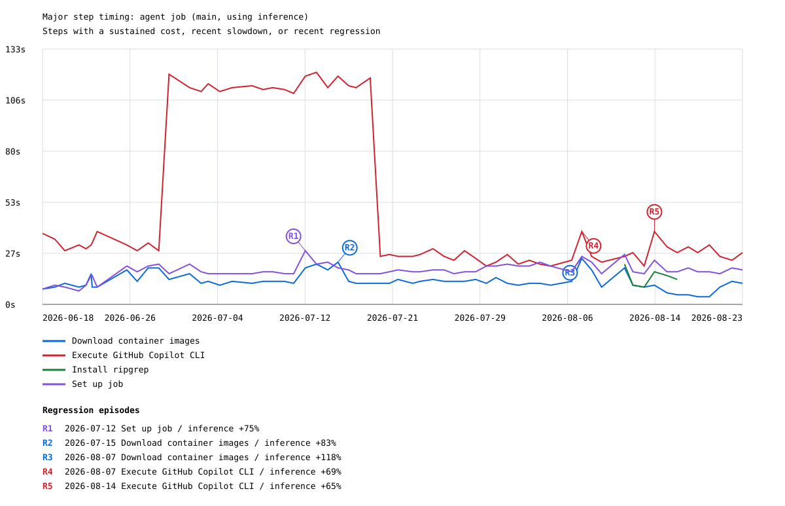

#### Candidate regressions (last six weeks)

| Label | Episode | Step | Peak | Prior median | Increase | Run | gh-aw version / commit |
|---|---|---|---:|---:|---:|---|---|
| R1 | 2026-07-12 | Set up job | 28.0s | 16.0s | 75% | [#312](https://github.com/githubnext/gh-aw-test/actions/runs/32534604788) | `v0.82.8-28-ge0a0e5d23d` / `e0a0e5d23d0e` |
| R2 | 2026-07-15 | Download container images | 22.0s | 12.0s | 83% | [#315](https://github.com/githubnext/gh-aw-test/actions/runs/32537059340) | `v0.82.9-134-gf0a3dd21c6` / `f0a3dd21c6e5` |
| R3 | 2026-08-07 | Download container images | 24.0s | 11.0s | 118% | [#340](https://github.com/githubnext/gh-aw-test/actions/runs/32552050221) | `v0.86.1-3-ge1e298d64b` / `e1e298d64bfa` |
| R4 | 2026-08-07 | Execute GitHub Copilot CLI | 38.0s | 22.5s | 69% | [#340](https://github.com/githubnext/gh-aw-test/actions/runs/32552050221) | `v0.86.1-3-ge1e298d64b` / `e1e298d64bfa` |
| R5 | 2026-08-14 | Execute GitHub Copilot CLI | 38.0s | 23.0s | 65% | [#349](https://github.com/githubnext/gh-aw-test/actions/runs/32556073604) | `v0.86.2-73-gc35faf436c` / `c35faf436c79` |

### Major step times for job `detection` (`main`, using inference)

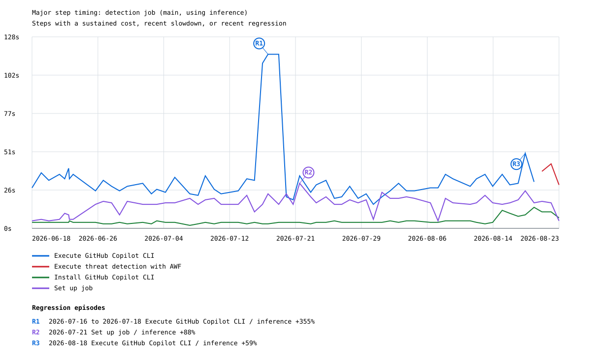

#### Candidate regressions (last six weeks)

| Label | Episode | Step | Peak | Prior median | Increase | Run | gh-aw version / commit |
|---|---|---|---:|---:|---:|---|---|
| R1 | 2026-07-16 to 2026-07-18 | Execute GitHub Copilot CLI | 116.0s | 25.5s | 355% | [#317](https://github.com/githubnext/gh-aw-test/actions/runs/32538498682) | `v0.82.12-7-gc096ffebd2` / `c096ffebd27f` |
| R2 | 2026-07-21 | Set up job | 30.0s | 16.0s | 88% | [#321](https://github.com/githubnext/gh-aw-test/actions/runs/32540903699) | `v0.82.15-23-g2a7ac3d34e` / `2a7ac3d34e2d` |
| R3 | 2026-08-18 | Execute GitHub Copilot CLI | 50.0s | 31.5s | 59% | [#353](https://github.com/githubnext/gh-aw-test/actions/runs/32558698273) | `v0.87.1-4-g4845f00caf` / `4845f00caf46` |

### Major step times for job `safe_outputs` (`main`, using inference)

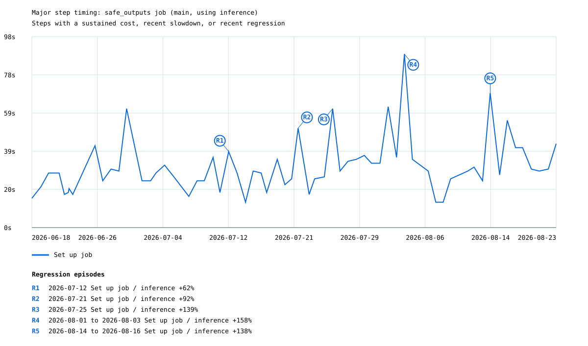

#### Candidate regressions (last six weeks)

| Label | Episode | Step | Peak | Prior median | Increase | Run | gh-aw version / commit |
|---|---|---|---:|---:|---:|---|---|
| R1 | 2026-07-12 | Set up job | 39.0s | 24.0s | 62% | [#312](https://github.com/githubnext/gh-aw-test/actions/runs/32534604788) | `v0.82.8-28-ge0a0e5d23d` / `e0a0e5d23d0e` |
| R2 | 2026-07-21 | Set up job | 51.0s | 26.5s | 92% | [#321](https://github.com/githubnext/gh-aw-test/actions/runs/32540903699) | `v0.82.15-23-g2a7ac3d34e` / `2a7ac3d34e2d` |
| R3 | 2026-07-25 | Set up job | 61.0s | 25.5s | 139% | [#325](https://github.com/githubnext/gh-aw-test/actions/runs/32542948173) | `v0.83.3-17-g11d9ea9de7` / `11d9ea9de729` |
| R4 | 2026-08-01 to 2026-08-03 | Set up job | 89.0s | 34.5s | 158% | [#334](https://github.com/githubnext/gh-aw-test/actions/runs/32547543586) | `v0.84.3-58-g53baccde53` / `53baccde5390` |
| R5 | 2026-08-03 | Setup Scripts | 41.0s | 4.5s | 811% | [#334](https://github.com/githubnext/gh-aw-test/actions/runs/32547543586) | `v0.84.3-58-g53baccde53` / `53baccde5390` |
| R6 | 2026-08-14 to 2026-08-16 | Set up job | 69.0s | 29.0s | 138% | [#349](https://github.com/githubnext/gh-aw-test/actions/runs/32556073604) | `v0.86.2-73-gc35faf436c` / `c35faf436c79` |

### Major step times for job `conclusion` (`main`, using inference)

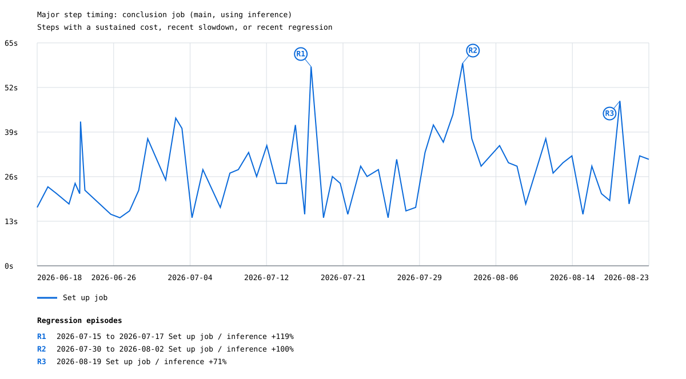

#### Candidate regressions (last six weeks)

| Label | Episode | Step | Peak | Prior median | Increase | Run | gh-aw version / commit |
|---|---|---|---:|---:|---:|---|---|
| R1 | 2026-07-15 to 2026-07-17 | Set up job | 58.0s | 26.5s | 119% | [#317](https://github.com/githubnext/gh-aw-test/actions/runs/32538498682) | `v0.82.12-7-gc096ffebd2` / `c096ffebd27f` |
| R2 | 2026-07-15 | Setup Scripts | 18.0s | 3.0s | 500% | [#315](https://github.com/githubnext/gh-aw-test/actions/runs/32537059340) | `v0.82.9-134-gf0a3dd21c6` / `f0a3dd21c6e5` |
| R3 | 2026-07-30 to 2026-08-02 | Set up job | 59.0s | 29.5s | 100% | [#333](https://github.com/githubnext/gh-aw-test/actions/runs/32547123314) | `v0.84.2-95-gf5bd99245e` / `f5bd99245e40` |
| R4 | 2026-08-03 | Setup Scripts | 14.0s | 4.0s | 250% | [#334](https://github.com/githubnext/gh-aw-test/actions/runs/32547543586) | `v0.84.3-58-g53baccde53` / `53baccde5390` |
| R5 | 2026-08-17 | Upload usage artifact | 11.0s | 1.0s | 1000% | [#352](https://github.com/githubnext/gh-aw-test/actions/runs/32558234273) | `v0.87.0-133-g2b2cf3fb01` / `2b2cf3fb01ee` |
| R6 | 2026-08-19 | Set up job | 48.0s | 28.0s | 71% | [#354](https://github.com/githubnext/gh-aw-test/actions/runs/32559121042) | `v0.87.1-44-g5d5e0af5c4` / `5d5e0af5c46c` |

## Run, job & step times (`released`, using inference)

**41 successful runs.** Regressions shown below are limited to the last six weeks.

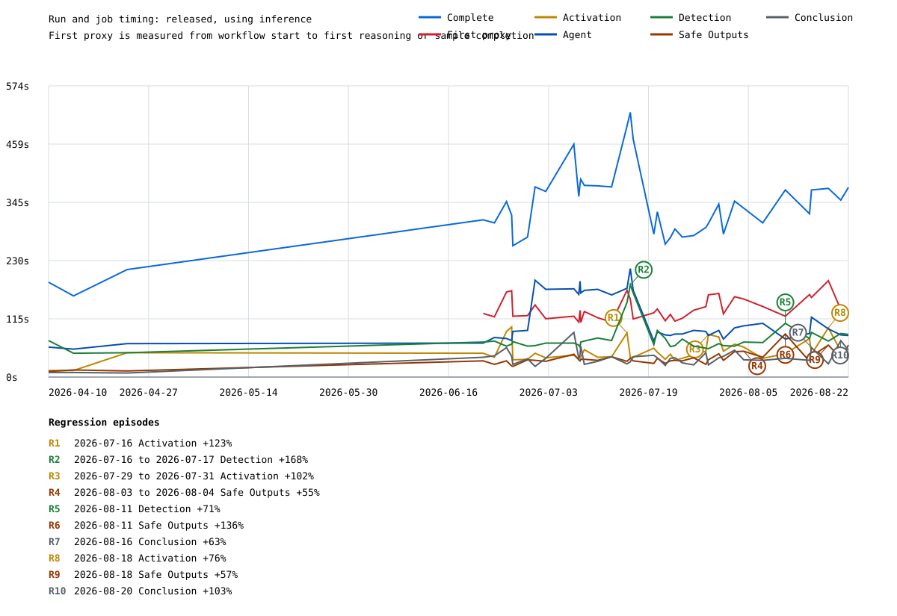

| Run or job | Samples | Median | P90 |
|---|---:|---:|---:|
| Workflow complete | 41 | 333.0s | 390.0s |
| Workflow start to proxy step | 41 | 107.0s | 144.0s |
| Proxy step to first reasoning/sample | 38 | 21.3s | 27.2s |
| Job `activation` | 41 | 45.0s | 84.0s |
| Job `agent` | 41 | 90.0s | 174.0s |
| Job `detection` | 41 | 69.0s | 92.0s |
| Job `safe_outputs` | 41 | 33.0s | 50.0s |
| Job `conclusion` | 41 | 37.0s | 58.0s |
| Major step `Execute GitHub Copilot CLI` | 41 | 28.0s | 120.0s |
| Major step `Set up job` | 41 | 18.0s | 22.0s |
| Major step `Download container images` | 41 | 12.0s | 18.0s |
| Major step `Install ripgrep` | 3 | 9.0s | 9.0s |
| Major step `Start MCP Gateway` | 41 | 6.0s | 10.0s |
| Major step `Install GitHub Copilot CLI` | 41 | 4.0s | 8.0s |
| Major step `Setup Scripts` | 38 | 3.0s | 5.3s |
| Major step `Install AWF binary` | 2 | 2.5s | 2.9s |
| Major step `Stop MCP Gateway` | 4 | 2.0s | 2.0s |
| Major step `Checkout repository` | 8 | 2.0s | 3.0s |
| Major step `Download activation artifact` | 12 | 2.0s | 2.0s |
| Major step `Upload agent artifacts` | 7 | 2.0s | 2.0s |
| Major step `Print firewall logs` | 1 | 2.0s | 2.0s |

### Major step times for job `activation` (`released`, using inference)

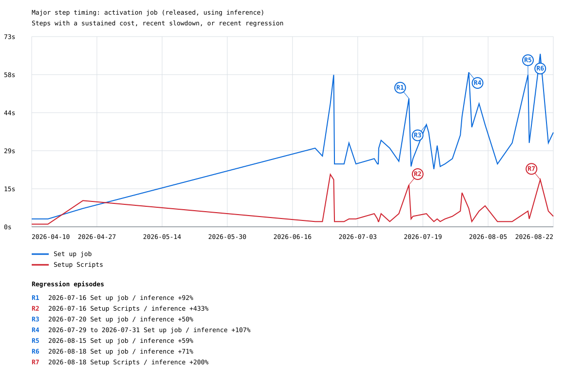

#### Candidate regressions (last six weeks)

| Label | Episode | Step | Peak | Prior median | Increase | Run | gh-aw version / commit |
|---|---|---|---:|---:|---:|---|---|
| R1 | 2026-07-16 | Set up job | 49.0s | 25.5s | 92% | [#368](https://github.com/githubnext/gh-aw-test/actions/runs/32582206315) | `v0.82.10` / `de126a1f352e` |
| R2 | 2026-07-16 | Setup Scripts | 16.0s | 3.0s | 433% | [#368](https://github.com/githubnext/gh-aw-test/actions/runs/32582206315) | `v0.82.10` / `de126a1f352e` |
| R3 | 2026-07-20 | Set up job | 39.0s | 26.0s | 50% | [#372](https://github.com/githubnext/gh-aw-test/actions/runs/32584729734) | `v0.82.14` / `8b820ae1073f` |
| R4 | 2026-07-29 to 2026-07-31 | Set up job | 59.0s | 28.5s | 107% | [#381](https://github.com/githubnext/gh-aw-test/actions/runs/32588868570) | `v0.84.1` / `ccf88b8a317e` |
| R5 | 2026-08-15 | Set up job | 58.0s | 36.5s | 59% | [#391](https://github.com/githubnext/gh-aw-test/actions/runs/32594433047) | `v0.86.3` / `6062cd2238b6` |
| R6 | 2026-08-18 | Set up job | 66.0s | 38.5s | 71% | [#393](https://github.com/githubnext/gh-aw-test/actions/runs/32595386878) | `v0.87.1` / `73def1609c73` |
| R7 | 2026-08-18 | Setup Scripts | 18.0s | 6.0s | 200% | [#393](https://github.com/githubnext/gh-aw-test/actions/runs/32595386878) | `v0.87.1` / `73def1609c73` |

### Major step times for job `agent` (`released`, using inference)

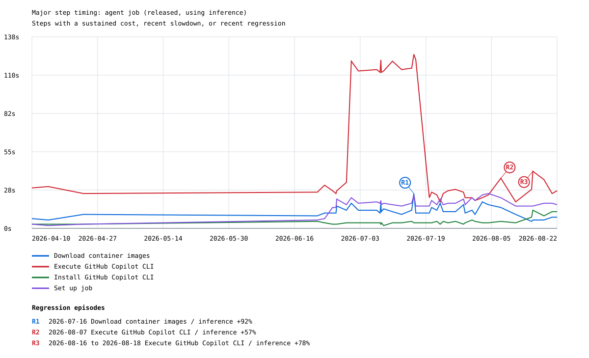

#### Candidate regressions (last six weeks)

| Label | Episode | Step | Peak | Prior median | Increase | Run | gh-aw version / commit |
|---|---|---|---:|---:|---:|---|---|
| R1 | 2026-07-16 | Download container images | 25.0s | 13.0s | 92% | [#369](https://github.com/githubnext/gh-aw-test/actions/runs/32582794047) | `v0.82.11` / `38e22c4075e3` |
| R2 | 2026-08-07 | Execute GitHub Copilot CLI | 36.0s | 23.0s | 57% | [#389](https://github.com/githubnext/gh-aw-test/actions/runs/32593480498) | `v0.86.1` / `475927dfc6d1` |
| R3 | 2026-08-16 to 2026-08-18 | Execute GitHub Copilot CLI | 41.0s | 23.0s | 78% | [#392](https://github.com/githubnext/gh-aw-test/actions/runs/32594896949) | `v0.87.0` / `10fb86318025` |

### Major step times for job `detection` (`released`, using inference)

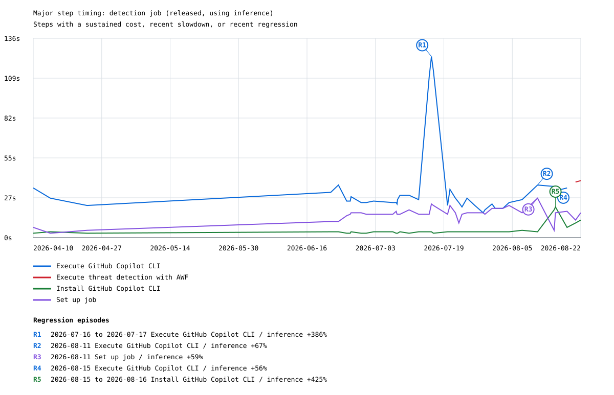

#### Candidate regressions (last six weeks)

| Label | Episode | Step | Peak | Prior median | Increase | Run | gh-aw version / commit |
|---|---|---|---:|---:|---:|---|---|
| R1 | 2026-07-16 to 2026-07-17 | Execute GitHub Copilot CLI | 124.0s | 25.5s | 386% | [#369](https://github.com/githubnext/gh-aw-test/actions/runs/32582794047) | `v0.82.11` / `38e22c4075e3` |
| R2 | 2026-08-11 | Execute GitHub Copilot CLI | 36.0s | 21.5s | 67% | [#390](https://github.com/githubnext/gh-aw-test/actions/runs/32593909670) | `v0.86.2` / `48e5fa3ff522` |
| R3 | 2026-08-11 | Set up job | 27.0s | 17.0s | 59% | [#390](https://github.com/githubnext/gh-aw-test/actions/runs/32593909670) | `v0.86.2` / `48e5fa3ff522` |
| R4 | 2026-08-15 | Execute GitHub Copilot CLI | 35.0s | 22.5s | 56% | [#391](https://github.com/githubnext/gh-aw-test/actions/runs/32594433047) | `v0.86.3` / `6062cd2238b6` |
| R5 | 2026-08-15 to 2026-08-16 | Install GitHub Copilot CLI | 21.0s | 4.0s | 425% | [#392](https://github.com/githubnext/gh-aw-test/actions/runs/32594896949) | `v0.87.0` / `10fb86318025` |

### Major step times for job `safe_outputs` (`released`, using inference)

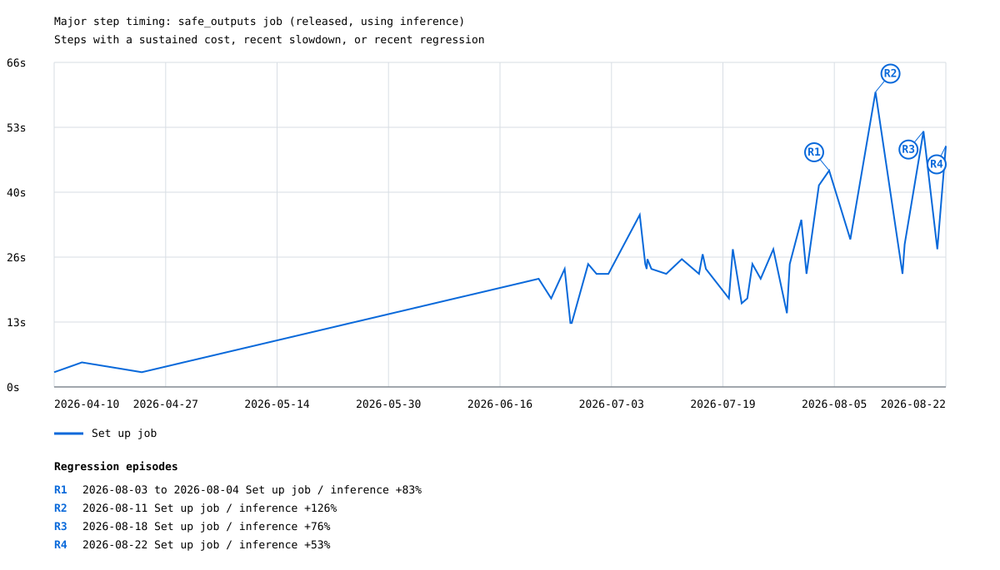

#### Candidate regressions (last six weeks)

| Label | Episode | Step | Peak | Prior median | Increase | Run | gh-aw version / commit |
|---|---|---|---:|---:|---:|---|---|
| R1 | 2026-08-03 to 2026-08-04 | Set up job | 44.0s | 24.0s | 83% | [#384](https://github.com/githubnext/gh-aw-test/actions/runs/32590303461) | `v0.84.4` / `918a49bd8c54` |
| R2 | 2026-08-11 | Set up job | 60.0s | 26.5s | 126% | [#390](https://github.com/githubnext/gh-aw-test/actions/runs/32593909670) | `v0.86.2` / `48e5fa3ff522` |
| R3 | 2026-08-11 | Setup Scripts | 16.0s | 3.0s | 433% | [#390](https://github.com/githubnext/gh-aw-test/actions/runs/32593909670) | `v0.86.2` / `48e5fa3ff522` |
| R4 | 2026-08-18 | Set up job | 52.0s | 29.5s | 76% | [#393](https://github.com/githubnext/gh-aw-test/actions/runs/32595386878) | `v0.87.1` / `73def1609c73` |
| R5 | 2026-08-22 | Set up job | 49.0s | 32.0s | 53% | [#395](https://github.com/githubnext/gh-aw-test/actions/runs/32596334559) | `v0.87.4` / `83d6315352f7` |

### Major step times for job `conclusion` (`released`, using inference)

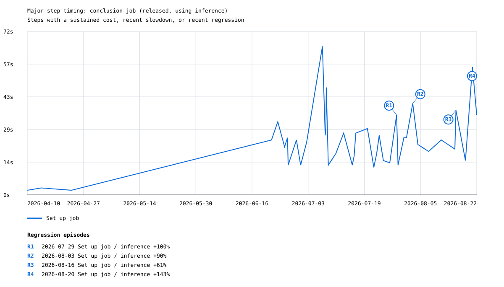

#### Candidate regressions (last six weeks)

| Label | Episode | Step | Peak | Prior median | Increase | Run | gh-aw version / commit |
|---|---|---|---:|---:|---:|---|---|
| R1 | 2026-07-29 | Set up job | 35.0s | 17.5s | 100% | [#379](https://github.com/githubnext/gh-aw-test/actions/runs/32587988061) | `v0.83.5` / `54b0997d61c9` |
| R2 | 2026-08-03 | Set up job | 40.0s | 21.0s | 90% | [#383](https://github.com/githubnext/gh-aw-test/actions/runs/32589823657) | `v0.84.3` / `53258938b59e` |
| R3 | 2026-08-16 | Set up job | 37.0s | 23.0s | 61% | [#392](https://github.com/githubnext/gh-aw-test/actions/runs/32594896949) | `v0.87.0` / `10fb86318025` |
| R4 | 2026-08-20 | Set up job | 56.0s | 23.0s | 143% | [#394](https://github.com/githubnext/gh-aw-test/actions/runs/32595871525) | `v0.87.2` / `d46b759176d4` |

## Run, job & step times (`main`, using samples)

**59 successful runs.** Regressions shown below are limited to the last six weeks.

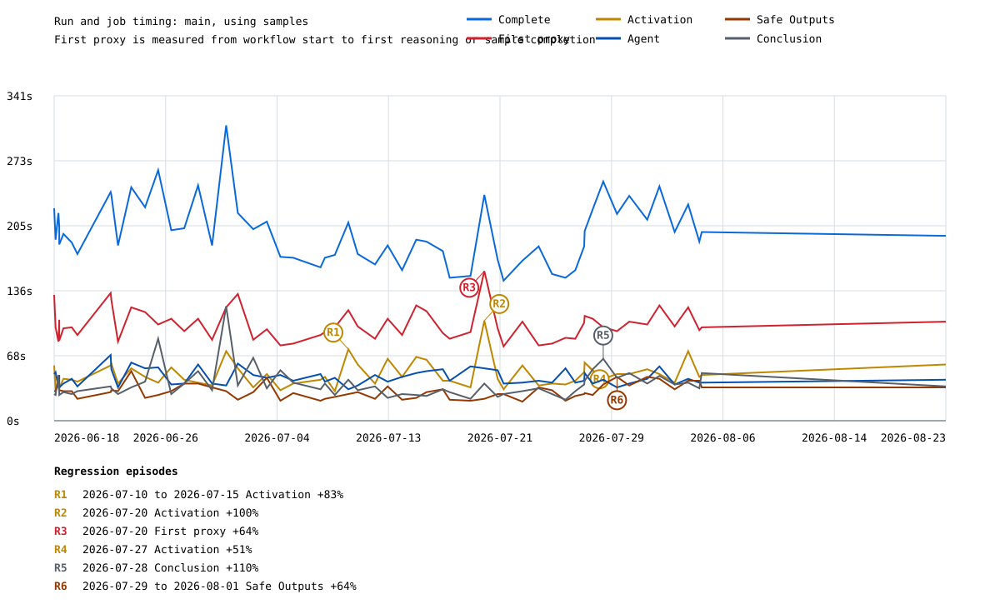

| Run or job | Samples | Median | P90 |
|---|---:|---:|---:|
| Workflow complete | 59 | 194.0s | 245.2s |
| Workflow start to proxy step | 59 | 98.0s | 121.0s |
| Proxy step to first reasoning/sample | 59 | 0.0s | 0.2s |
| Job `activation` | 59 | 46.0s | 64.2s |
| Job `agent` | 59 | 44.0s | 56.2s |
| Job `detection` | 0 | n/a | n/a |
| Job `safe_outputs` | 59 | 31.0s | 42.2s |
| Job `conclusion` | 59 | 34.0s | 53.2s |
| Major step `Download container images` | 59 | 9.0s | 13.0s |
| Major step `Set up job` | 59 | 7.0s | 12.0s |
| Major step `Start MCP Gateway` | 59 | 7.0s | 11.2s |
| Major step `Install GitHub Copilot CLI` | 59 | 4.0s | 5.0s |
| Major step `Setup Scripts` | 58 | 2.0s | 4.0s |
| Major step `Checkout repository` | 9 | 2.0s | 2.0s |
| Major step `Install AWF binary` | 3 | 2.0s | 2.0s |
| Major step `Download activation artifact` | 16 | 2.0s | 2.0s |
| Major step `Upload agent artifacts` | 9 | 2.0s | 2.0s |
| Major step `Stop MCP Gateway` | 6 | 2.0s | 2.0s |

### Major step times for job `activation` (`main`, using samples)

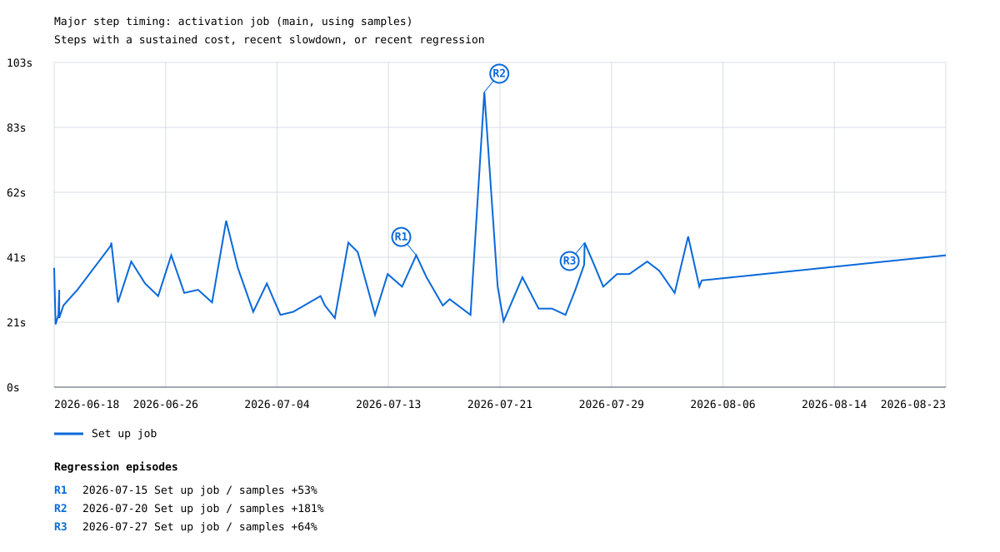

#### Candidate regressions (last six weeks)

| Label | Episode | Step | Peak | Prior median | Increase | Run | gh-aw version / commit |
|---|---|---|---:|---:|---:|---|---|
| R1 | 2026-07-15 | Set up job | 42.0s | 27.5s | 53% | [#224](https://github.com/githubnext/gh-aw-test/actions/runs/29388180753) | `61336cb2af` / `61336cb2af49` |
| R2 | 2026-07-20 | Set up job | 94.0s | 33.5s | 181% | [#239](https://github.com/githubnext/gh-aw-test/actions/runs/29716703808) | `7bdc455764` / `7bdc455764ae` |
| R3 | 2026-07-27 | Set up job | 46.0s | 28.0s | 64% | [#266](https://github.com/githubnext/gh-aw-test/actions/runs/30271118206) | `55b5181bb8` / `55b5181bb855` |

### Major step times for job `agent` (`main`, using samples)

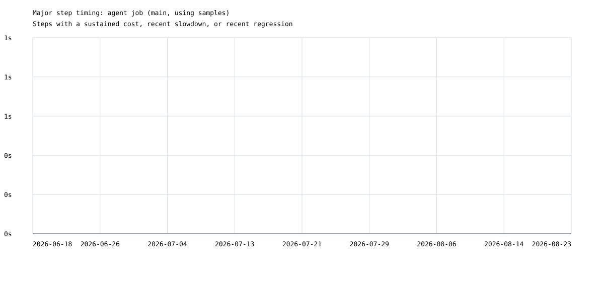

#### Candidate regressions (last six weeks)

No candidate regressions in the last six weeks.

### Major step times for job `detection` (`main`, using samples)

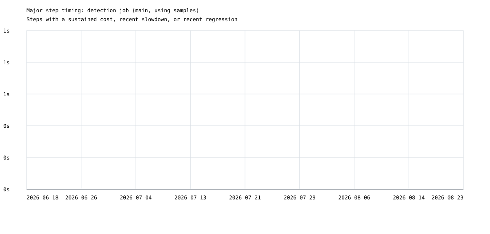

#### Candidate regressions (last six weeks)

No candidate regressions in the last six weeks.

### Major step times for job `safe_outputs` (`main`, using samples)

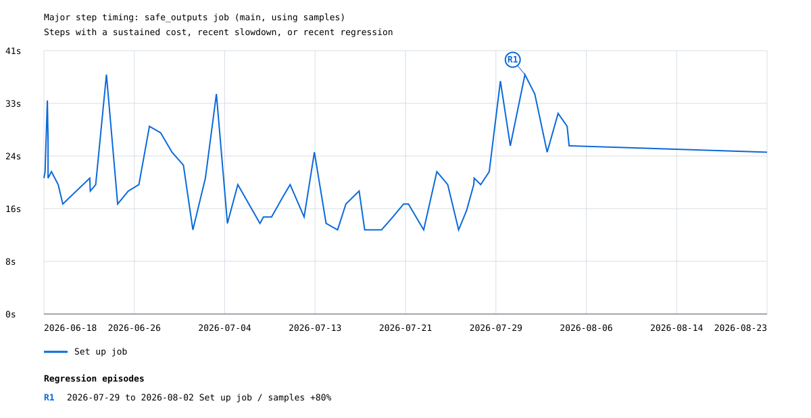

#### Candidate regressions (last six weeks)

| Label | Episode | Step | Peak | Prior median | Increase | Run | gh-aw version / commit |
|---|---|---|---:|---:|---:|---|---|
| R1 | 2026-07-29 to 2026-08-02 | Set up job | 37.0s | 20.5s | 80% | [#279](https://github.com/githubnext/gh-aw-test/actions/runs/30683496745) | `a9137e1445` / `a9137e144504` |

### Major step times for job `conclusion` (`main`, using samples)

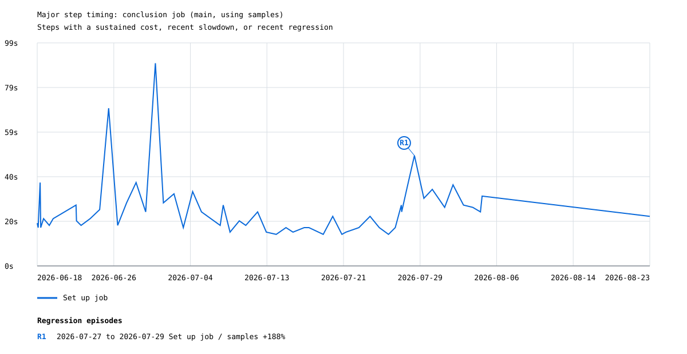

#### Candidate regressions (last six weeks)

| Label | Episode | Step | Peak | Prior median | Increase | Run | gh-aw version / commit |
|---|---|---|---:|---:|---:|---|---|
| R1 | 2026-07-27 to 2026-07-29 | Set up job | 49.0s | 17.0s | 188% | [#270](https://github.com/githubnext/gh-aw-test/actions/runs/30421452781) | `acc797bbab` / `acc797bbab36` |

## Run, job & step times (`released`, using samples)

**90 successful runs.** Regressions shown below are limited to the last six weeks.

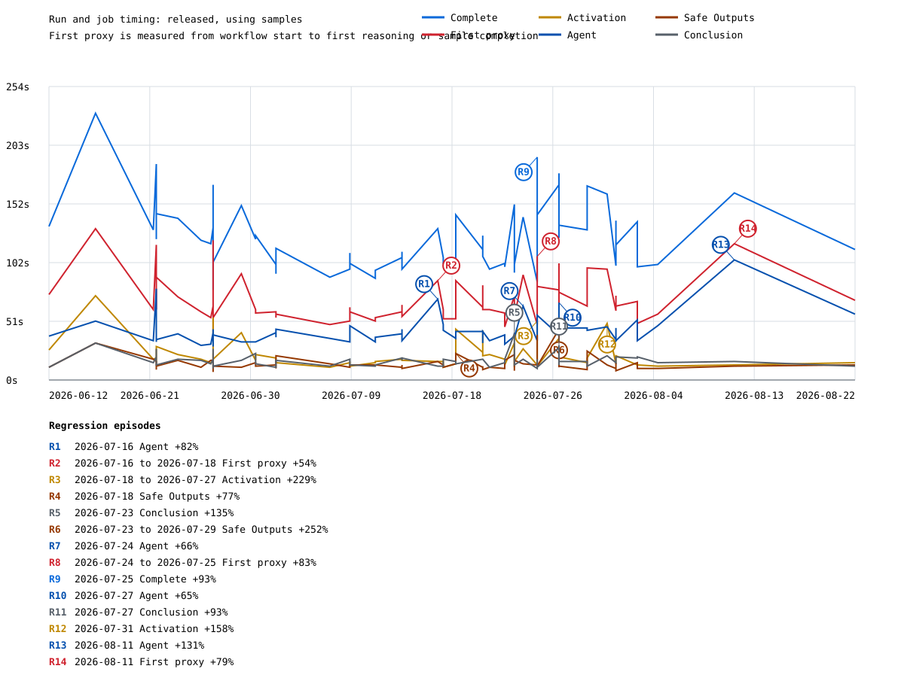

| Run or job | Samples | Median | P90 |
|---|---:|---:|---:|
| Workflow complete | 90 | 115.5s | 161.1s |
| Workflow start to proxy step | 90 | 61.0s | 93.3s |
| Proxy step to first reasoning/sample | 90 | 0.0s | 1.0s |
| Job `activation` | 90 | 16.5s | 36.5s |
| Job `agent` | 90 | 39.5s | 48.3s |
| Job `detection` | 0 | n/a | n/a |
| Job `safe_outputs` | 90 | 12.0s | 20.1s |
| Job `conclusion` | 90 | 16.0s | 21.1s |
| Major step `Install ripgrep` | 1 | 25.0s | 25.0s |
| Major step `Download container images` | 90 | 9.0s | 15.1s |
| Major step `Start MCP Gateway` | 90 | 7.0s | 12.0s |
| Major step `Install GitHub Copilot CLI` | 90 | 4.0s | 5.0s |
| Major step `Set up job` | 77 | 2.0s | 5.0s |
| Major step `Setup Scripts` | 79 | 2.0s | 4.0s |
| Major step `Install AWF binary` | 7 | 2.0s | 2.4s |
| Major step `Download activation artifact` | 30 | 2.0s | 2.0s |
| Major step `Upload agent artifacts` | 20 | 2.0s | 2.0s |
| Major step `Stop MCP Gateway` | 10 | 2.0s | 2.0s |
| Major step `Checkout repository` | 3 | 2.0s | 2.0s |

### Major step times for job `activation` (`released`, using samples)

#### Candidate regressions (last six weeks)

| Label | Episode | Step | Peak | Prior median | Increase | Run | gh-aw version / commit |
|---|---|---|---:|---:|---:|---|---|
| R1 | 2026-07-18 to 2026-07-20 | Setup Scripts | 33.0s | 2.0s | 1550% | [#241](https://github.com/githubnext/gh-aw-test/actions/runs/29718236306) | `v0.82.13` / `017cdbc1b474` |
| R2 | 2026-07-23 to 2026-07-27 | Set up job | 21.0s | 3.0s | 600% | [#264](https://github.com/githubnext/gh-aw-test/actions/runs/30253250421) | `v0.83.4` / `bbb804287845` |
| R3 | 2026-07-25 | Setup Scripts | 18.0s | 2.5s | 620% | [#268](https://github.com/githubnext/gh-aw-test/actions/runs/30329600083) | `v0.83.3` / `7e728ffd6fc9` |

### Major step times for job `agent` (`released`, using samples)

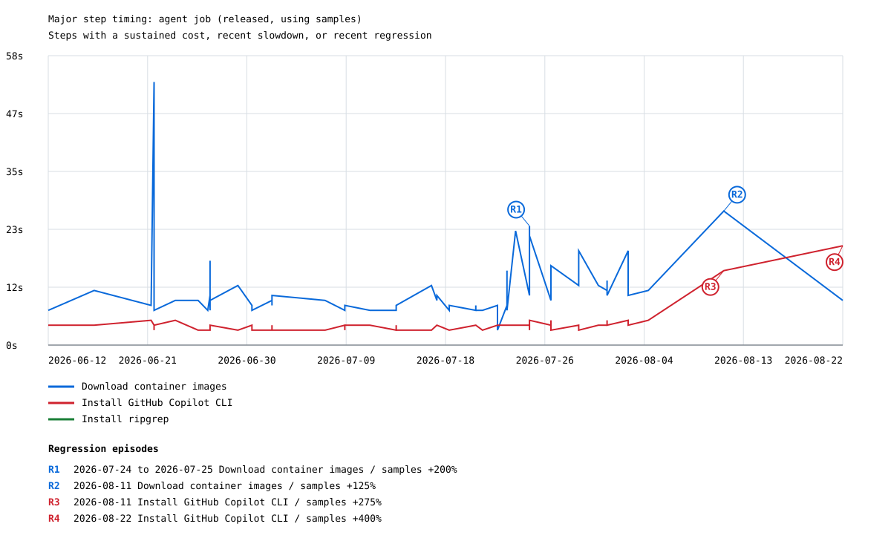

#### Candidate regressions (last six weeks)

| Label | Episode | Step | Peak | Prior median | Increase | Run | gh-aw version / commit |
|---|---|---|---:|---:|---:|---|---|
| R1 | 2026-07-16 | Set up job | 32.0s | 2.0s | 1500% | [#232](https://github.com/githubnext/gh-aw-test/actions/runs/29555946105) | `v0.82.11` / `38e22c4075e3` |
| R2 | 2026-07-24 to 2026-07-25 | Download container images | 24.0s | 8.0s | 200% | [#263](https://github.com/githubnext/gh-aw-test/actions/runs/30238750701) | `v0.83.3` / `7e728ffd6fc9` |
| R3 | 2026-07-27 | Set up job | 28.0s | 3.0s | 833% | [#269](https://github.com/githubnext/gh-aw-test/actions/runs/30330754586) | `v0.83.4` / `bbb804287845` |
| R4 | 2026-08-11 | Download container images | 27.0s | 12.0s | 125% | [#398](https://github.com/githubnext/gh-aw-test/actions/runs/32617180095) | `v0.86.2` / `48e5fa3ff522` |
| R5 | 2026-08-11 | Install GitHub Copilot CLI | 15.0s | 4.0s | 275% | [#398](https://github.com/githubnext/gh-aw-test/actions/runs/32617180095) | `v0.86.2` / `48e5fa3ff522` |
| R6 | 2026-08-22 | Install GitHub Copilot CLI | 20.0s | 4.0s | 400% | [#399](https://github.com/githubnext/gh-aw-test/actions/runs/32618677146) | `v0.87.4` / `83d6315352f7` |

### Major step times for job `detection` (`released`, using samples)

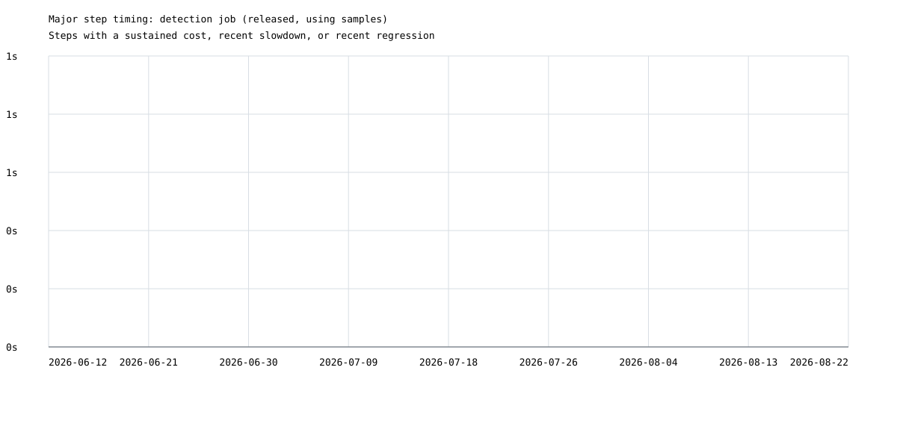

#### Candidate regressions (last six weeks)

No candidate regressions in the last six weeks.

### Major step times for job `safe_outputs` (`released`, using samples)

#### Candidate regressions (last six weeks)

| Label | Episode | Step | Peak | Prior median | Increase | Run | gh-aw version / commit |
|---|---|---|---:|---:|---:|---|---|
| R1 | 2026-07-23 | Set up job | 14.0s | 2.5s | 460% | [#251](https://github.com/githubnext/gh-aw-test/actions/runs/30006117618) | `v0.83.1` / `6268b9870d9f` |
| R2 | 2026-07-25 | Setup Scripts | 20.0s | 2.0s | 900% | [#268](https://github.com/githubnext/gh-aw-test/actions/runs/30329600083) | `v0.83.3` / `7e728ffd6fc9` |
| R3 | 2026-07-27 | Set up job | 29.0s | 3.0s | 867% | [#264](https://github.com/githubnext/gh-aw-test/actions/runs/30253250421) | `v0.83.4` / `bbb804287845` |

### Major step times for job `conclusion` (`released`, using samples)

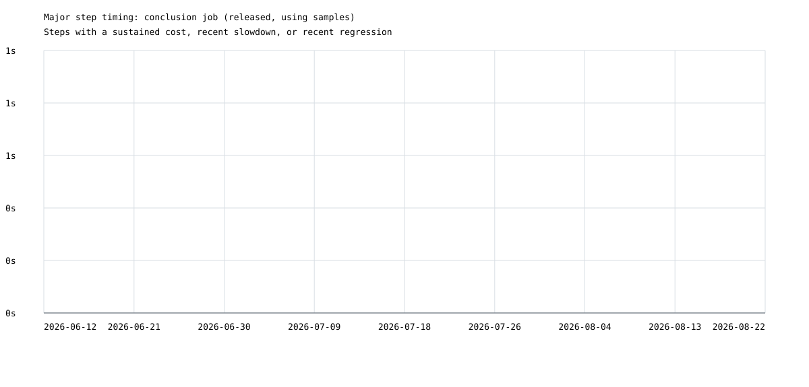

#### Candidate regressions (last six weeks)

| Label | Episode | Step | Peak | Prior median | Increase | Run | gh-aw version / commit |
|---|---|---|---:|---:|---:|---|---|
| R1 | 2026-07-23 | Set up job | 23.0s | 3.0s | 667% | [#251](https://github.com/githubnext/gh-aw-test/actions/runs/30006117618) | `v0.83.1` / `6268b9870d9f` |
| R2 | 2026-07-27 | Set up job | 16.0s | 2.5s | 540% | [#264](https://github.com/githubnext/gh-aw-test/actions/runs/30253250421) | `v0.83.4` / `bbb804287845` |

## Method

Each section fixes both independent dimensions: gh-aw source (`main` or combined stable/pre-release `released`) and execution mode (`inference` or `samples`). Only overall-successful `workflow_dispatch` runs with a successful `agent` job are included. Candidate regression baselines use up to ten preceding observations from the same section and step; displayed regression episodes are limited to the six weeks before report generation. A step is graphed when it has a sustained cost, recent slowdown, or recent regression. Runs with missing compiler metadata remain in CSV/JSON but are excluded from graphs.
