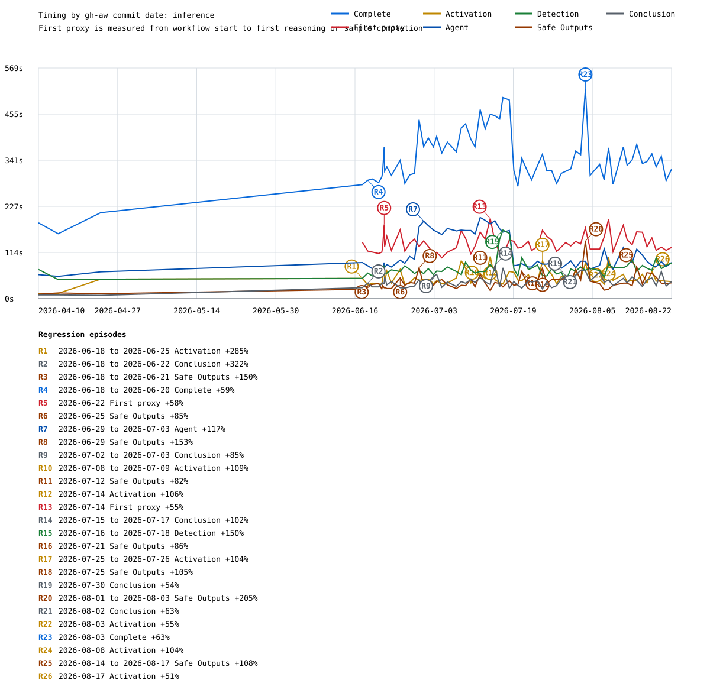
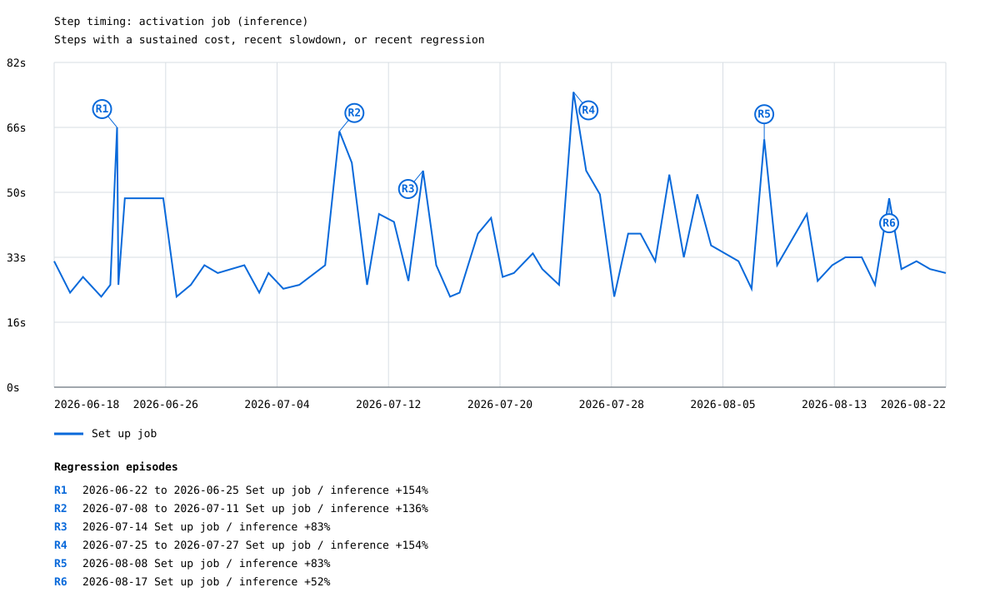
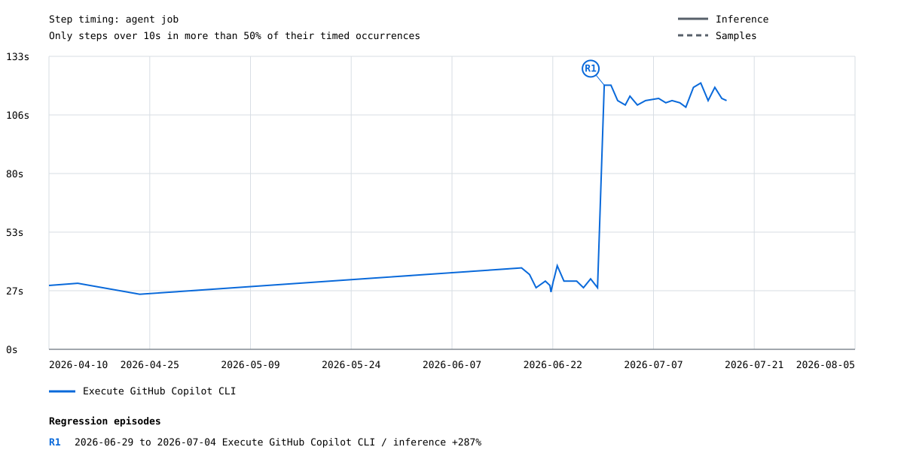
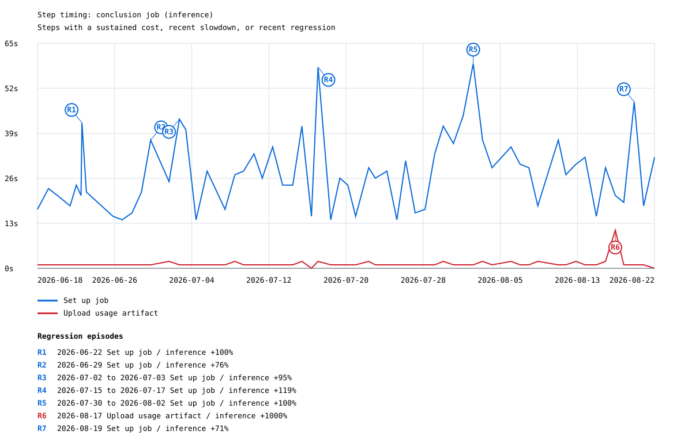
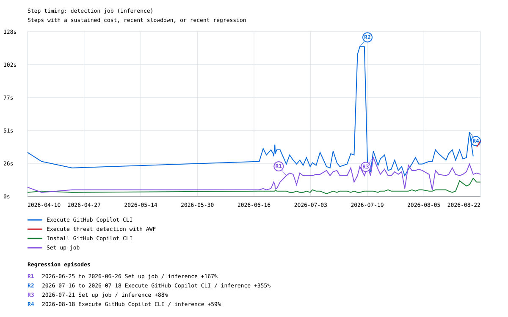
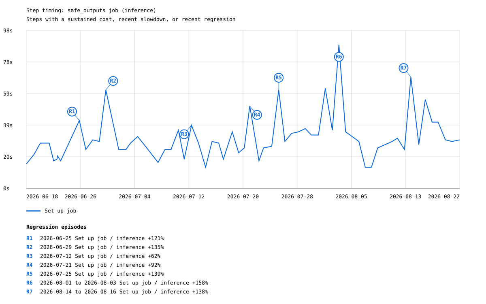

# Copilot create-issue timing

Analyzed **196** successful agent runs: **37 inference** and **159 samples**.

| Metric | Samples | Median | P90 | Min | Max |
|---|---:|---:|---:|---:|---:|
| Time to complete | 196 | 171.0s | 333.0s | 78.0s | 496.0s |
| Time to first reasoning/sample proxy | 191 | 92.0s | 130.0s | 41.0s | 197.4s |

Solid lines are inference runs; dashed lines of the same color are sample runs. The x-axis is the commit time of the resolved gh-aw commit, not the workflow run time.

## Candidate regressions

Found **42 threshold crossings** grouped into **14 episodes**. Baselines are calculated separately for inference and sample runs; each `R#` labels the largest increase in an episode whose crossings are no more than three gh-aw commit-days apart.

| Label | Episode | Mode | Metric | Peak | Prior median | Increase | Run | gh-aw version / commit |
|---|---|---|---|---:|---:|---:|---|---|
| R1 | 2026-06-18 to 2026-06-20 (3 points) | inference | time_to_complete_seconds | 292.0s | 184.0s | 59% | [#145](https://github.com/githubnext/gh-aw-test/actions/runs/27805721716) | `393419b2fb` / `393419b2fbab` |
| R2 | 2026-06-22 (1 point) | inference | time_to_first_reasoning_seconds | 182.8s | 115.9s | 58% | [#153](https://github.com/githubnext/gh-aw-test/actions/runs/27966398112) | `42a1743825` / `42a1743825aa` |
| R3 | 2026-06-22 to 2026-07-04 (12 points) | samples | time_to_complete_seconds | 310.0s | 123.5s | 151% | [#184](https://github.com/githubnext/gh-aw-test/actions/runs/28493889040) | `a146daa7e6` / `a146daa7e61e` |
| R4 | 2026-06-22 to 2026-06-24 (3 points) | samples | time_to_first_reasoning_seconds | 134.0s | 75.5s | 77% | [#154](https://github.com/githubnext/gh-aw-test/actions/runs/27969702756) | `efe940eb13` / `efe940eb13d0` |
| R5 | 2026-06-27 to 2026-07-04 (9 points) | samples | time_to_first_reasoning_seconds | 121.0s | 60.0s | 102% | [#207](https://github.com/githubnext/gh-aw-test/actions/runs/28994888262) | `v0.81.6` / `eed4304d8740` |
| R6 | 2026-07-14 (1 point) | inference | time_to_first_reasoning_seconds | 197.4s | 127.3s | 55% | [#314](https://github.com/githubnext/gh-aw-test/actions/runs/32536396153) | `v0.82.9-54-gdf13f08917` / `df13f0891719` |
| R7 | 2026-07-15 (2 points) | samples | time_to_first_reasoning_seconds | 121.0s | 75.5s | 60% | [#224](https://github.com/githubnext/gh-aw-test/actions/runs/29388180753) | `61336cb2af` / `61336cb2af49` |
| R8 | 2026-07-16 to 2026-07-17 (2 points) | inference | detection_job_seconds | 169.0s | 67.5s | 150% | [#317](https://github.com/githubnext/gh-aw-test/actions/runs/32538498682) | `v0.82.12-7-gc096ffebd2` / `c096ffebd27f` |
| R9 | 2026-07-20 (1 point) | samples | time_to_complete_seconds | 237.0s | 146.5s | 62% | [#239](https://github.com/githubnext/gh-aw-test/actions/runs/29716703808) | `7bdc455764` / `7bdc455764ae` |
| R10 | 2026-07-20 (1 point) | samples | time_to_first_reasoning_seconds | 157.0s | 86.0s | 83% | [#239](https://github.com/githubnext/gh-aw-test/actions/runs/29716703808) | `7bdc455764` / `7bdc455764ae` |
| R11 | 2026-07-24 to 2026-07-25 (3 points) | samples | time_to_complete_seconds | 183.0s | 100.0s | 83% | [#252](https://github.com/githubnext/gh-aw-test/actions/runs/30066002900) | `755ee4dea3` / `755ee4dea341` |
| R12 | 2026-07-24 to 2026-07-25 (2 points) | samples | time_to_first_reasoning_seconds | 107.0s | 66.0s | 62% | [#268](https://github.com/githubnext/gh-aw-test/actions/runs/30329600083) | `v0.83.3` / `7e728ffd6fc9` |
| R13 | 2026-07-28 (1 point) | samples | time_to_complete_seconds | 251.0s | 159.0s | 58% | [#270](https://github.com/githubnext/gh-aw-test/actions/runs/30421452781) | `acc797bbab` / `acc797bbab36` |
| R14 | 2026-08-04 (1 point) | samples | time_to_complete_seconds | 227.0s | 149.5s | 52% | [#288](https://github.com/githubnext/gh-aw-test/actions/runs/30876764168) | `021887f5dc` / `021887f5dce3` |

## Job and major steps

| Job or step | Samples | Median | P90 |
|---|---:|---:|---:|
| Workflow start to proxy step | 196 | 89.0s | 122.0s |
| Proxy step to reasoning/sample proxy | 191 | 0.0s | 18.4s |
| Agent job | 196 | 43.0s | 97.0s |
| Execute GitHub Copilot CLI | 37 | 38.0s | 119.0s |
| Detection job | 36 | 67.0s | 83.5s |
| Download container images | 196 | 9.0s | 16.0s |
| Start MCP Gateway | 196 | 7.0s | 11.5s |
| Set up job | 183 | 6.0s | 16.0s |
| Install GitHub Copilot CLI | 196 | 4.0s | 5.0s |
| Upload agent artifacts | 45 | 2.0s | 2.0s |
| Setup Scripts | 179 | 2.0s | 4.0s |
| Download activation artifact | 65 | 2.0s | 2.0s |
| Install AWF binary | 13 | 2.0s | 2.0s |
| Checkout repository | 18 | 2.0s | 2.0s |
| Stop MCP Gateway | 19 | 2.0s | 2.0s |

## Step timing by job

A step is included when its duration is over 10 seconds in more than 50% of its timed occurrences. Exact job and step names define each series, so renamed steps begin or end naturally.

### activation

| Step | Timed occurrences | Over 10s | Median | P90 |
|---|---:|---:|---:|---:|
| Set up job | 196 | 57% | 21.0s | 40.0s |

### agent

| Step | Timed occurrences | Over 10s | Median | P90 |
|---|---:|---:|---:|---:|
| Execute GitHub Copilot CLI | 37 | 100% | 38.0s | 119.0s |

### conclusion

| Step | Timed occurrences | Over 10s | Median | P90 |
|---|---:|---:|---:|---:|
| Set up job | 196 | 56% | 14.0s | 32.0s |

### detection

| Step | Timed occurrences | Over 10s | Median | P90 |
|---|---:|---:|---:|---:|
| Execute GitHub Copilot CLI | 36 | 100% | 29.0s | 36.5s |
| Set up job | 36 | 64% | 16.0s | 19.5s |

### safe_outputs

| Step | Timed occurrences | Over 10s | Median | P90 |
|---|---:|---:|---:|---:|
| Set up job | 196 | 56% | 13.0s | 28.0s |

## Method

Only overall-successful `workflow_dispatch` runs with a successful `agent` job are included. Inference runs require a successful `Execute GitHub Copilot CLI` step; sample runs require a successful deterministic replay step. Time to complete is `run.updated_at - run.run_started_at`. The first-proxy metric is end to end from `run.run_started_at`. For inference, its endpoint is the first timestamped assistant/reasoning event or agent-originated `tools/call`; for samples, it is deterministic replay completion. Detection is the standalone `detection` job duration and is present only for non-sample runs. Step durations come directly from the GitHub Actions jobs API (`completed_at - started_at`) for successful steps in successful jobs. Runs without resolvable gh-aw commit dates remain in CSV/JSON but are omitted from the time-axis graphs.
