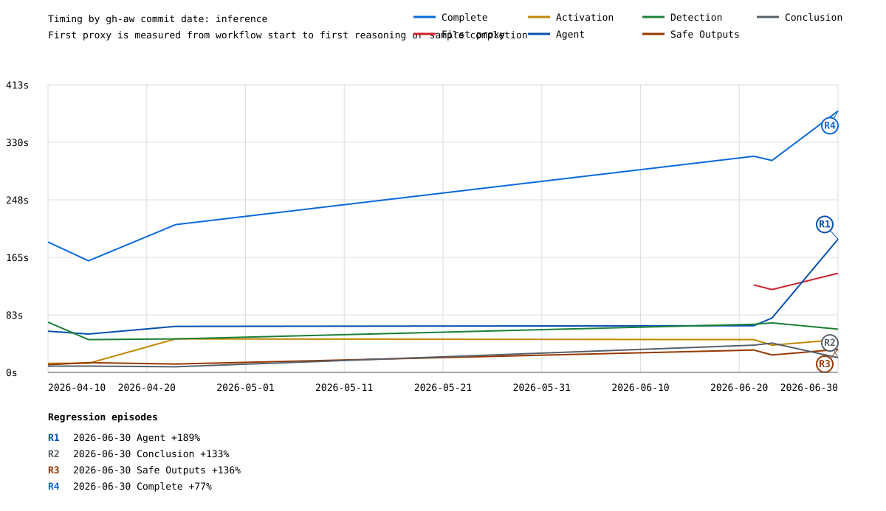
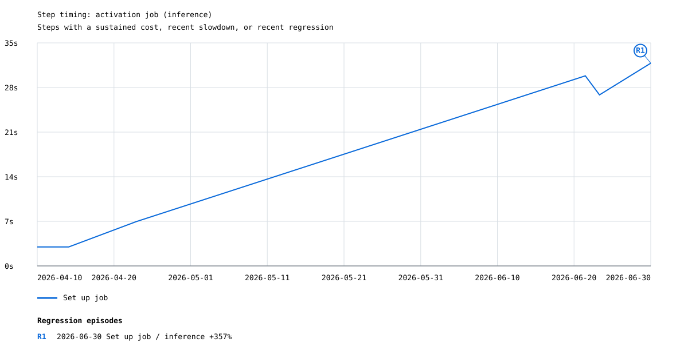
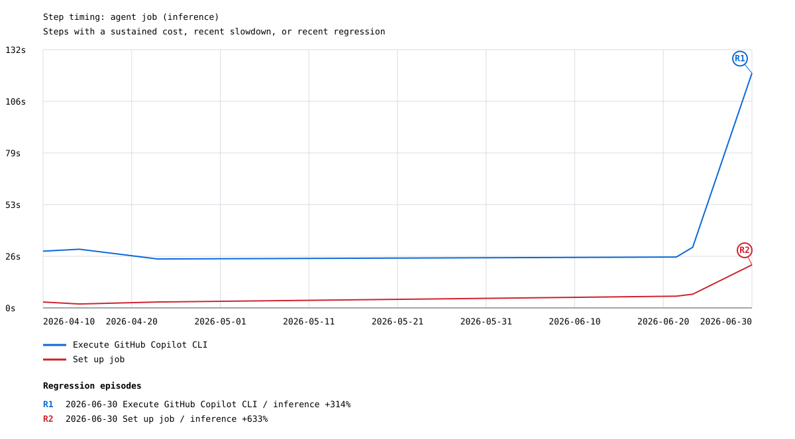
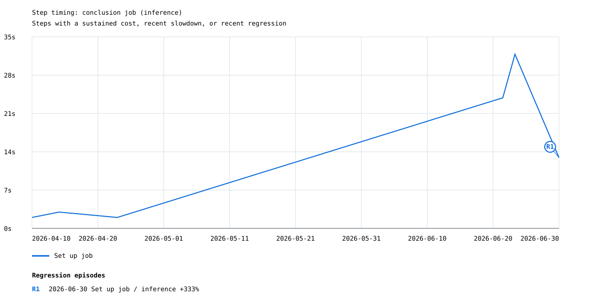
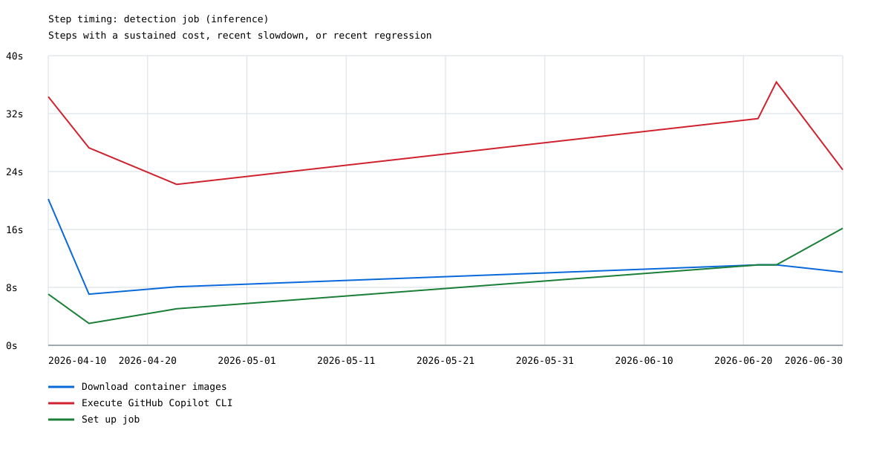
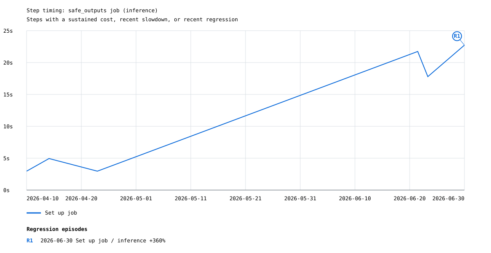

# Copilot create-issue timing

## Main vs released

| Run group | Successful runs | Inference | Samples | Median complete | P90 complete |
|---|---:|---:|---:|---:|---:|
| `--gh-aw-ref main` | 120 | 62 | 58 | 283.0s | 396.4s |
| Released tags | 94 | 6 | 88 | 121.5s | 169.0s |

Primary analysis uses only the **120 successful runs compiled with `--gh-aw-ref main`**.

| Metric | Samples | Median | P90 | Min | Max |
|---|---:|---:|---:|---:|---:|
| Time to complete | 120 | 283.0s | 396.4s | 147.0s | 517.0s |
| Time to first reasoning/sample proxy | 120 | 116.7s | 154.1s | 78.0s | 197.4s |

The primary x-axis is the commit time of the resolved gh-aw main commit, not the workflow run time. Inference and deterministic sample runs are graphed separately. Stable and pre-release tags are combined into the released graph set at the end.

## Main inference timing

## Main sample timing

## Candidate regressions on main

Found **57 threshold crossings** grouped into **35 episodes**. Baselines use only `--gh-aw-ref main` runs and are calculated separately for inference and sample runs; each `R#` labels the largest increase in an episode whose crossings are no more than three gh-aw commit-days apart.

| Label | Episode | Mode | Metric | Peak | Prior median | Increase | Run | gh-aw version / commit |
|---|---|---|---|---:|---:|---:|---|---|
| R1 | 2026-06-22 to 2026-06-25 (3 points) | inference | Activation | 81.0s | 36.0s | 125% | [#153](https://github.com/githubnext/gh-aw-test/actions/runs/27966398112) | `42a1743825` / `42a1743825aa` |
| R2 | 2026-06-22 (1 point) | inference | First proxy | 182.8s | 114.8s | 59% | [#153](https://github.com/githubnext/gh-aw-test/actions/runs/27966398112) | `42a1743825` / `42a1743825aa` |
| R3 | 2026-06-22 (1 point) | samples | Agent | 69.0s | 44.0s | 57% | [#154](https://github.com/githubnext/gh-aw-test/actions/runs/27969702756) | `efe940eb13` / `efe940eb13d0` |
| R4 | 2026-06-22 (1 point) | inference | Conclusion | 53.0s | 33.0s | 61% | [#155](https://github.com/githubnext/gh-aw-test/actions/runs/27970094123) | `5fdf022bd5` / `5fdf022bd581` |
| R5 | 2026-06-24 (1 point) | samples | Safe Outputs | 52.0s | 31.0s | 68% | [#164](https://github.com/githubnext/gh-aw-test/actions/runs/28078251384) | `5373e080d7` / `5373e080d733` |
| R6 | 2026-06-25 (1 point) | inference | Safe Outputs | 51.0s | 27.5s | 85% | [#295](https://github.com/githubnext/gh-aw-test/actions/runs/32516874360) | `v0.81.3-44-g42b108eaae` / `42b108eaae3a` |
| R7 | 2026-06-26 to 2026-07-03 (4 points) | samples | Conclusion | 120.0s | 35.5s | 238% | [#184](https://github.com/githubnext/gh-aw-test/actions/runs/28493889040) | `a146daa7e6` / `a146daa7e61e` |
| R8 | 2026-06-29 to 2026-07-04 (5 points) | inference | Agent | 177.0s | 85.5s | 107% | [#299](https://github.com/githubnext/gh-aw-test/actions/runs/32520135455) | `v0.82.0-41-g663ad7b5aa` / `663ad7b5aa7c` |
| R9 | 2026-06-29 (1 point) | inference | Conclusion | 47.0s | 30.0s | 57% | [#299](https://github.com/githubnext/gh-aw-test/actions/runs/32520135455) | `v0.82.0-41-g663ad7b5aa` / `663ad7b5aa7c` |
| R10 | 2026-06-29 (1 point) | inference | Safe Outputs | 76.0s | 34.0s | 124% | [#299](https://github.com/githubnext/gh-aw-test/actions/runs/32520135455) | `v0.82.0-41-g663ad7b5aa` / `663ad7b5aa7c` |
| R11 | 2026-07-01 (1 point) | samples | Activation | 73.0s | 44.5s | 64% | [#184](https://github.com/githubnext/gh-aw-test/actions/runs/28493889040) | `a146daa7e6` / `a146daa7e61e` |
| R12 | 2026-07-02 to 2026-07-03 (2 points) | inference | Conclusion | 60.0s | 35.5s | 69% | [#303](https://github.com/githubnext/gh-aw-test/actions/runs/32525853446) | `v0.82.2-48-g332d5e24d2` / `332d5e24d2c6` |
| R13 | 2026-07-08 to 2026-07-09 (2 points) | inference | Activation | 93.0s | 41.0s | 127% | [#308](https://github.com/githubnext/gh-aw-test/actions/runs/32531331276) | `v0.82.6-11-gbd5467ff41` / `bd5467ff4106` |
| R14 | 2026-07-10 to 2026-07-15 (3 points) | samples | Activation | 75.0s | 41.0s | 83% | [#209](https://github.com/githubnext/gh-aw-test/actions/runs/29069069292) | `2de7b7329d` / `2de7b7329de2` |
| R15 | 2026-07-12 (1 point) | inference | Safe Outputs | 60.0s | 33.0s | 82% | [#312](https://github.com/githubnext/gh-aw-test/actions/runs/32534604788) | `v0.82.8-28-ge0a0e5d23d` / `e0a0e5d23d0e` |
| R16 | 2026-07-14 (1 point) | inference | Activation | 104.0s | 50.5s | 106% | [#314](https://github.com/githubnext/gh-aw-test/actions/runs/32536396153) | `v0.82.9-54-gdf13f08917` / `df13f0891719` |
| R17 | 2026-07-14 (1 point) | inference | First proxy | 197.4s | 127.3s | 55% | [#314](https://github.com/githubnext/gh-aw-test/actions/runs/32536396153) | `v0.82.9-54-gdf13f08917` / `df13f0891719` |
| R18 | 2026-07-15 to 2026-07-17 (2 points) | inference | Conclusion | 82.0s | 40.5s | 102% | [#315](https://github.com/githubnext/gh-aw-test/actions/runs/32537059340) | `v0.82.9-134-gf0a3dd21c6` / `f0a3dd21c6e5` |
| R19 | 2026-07-16 to 2026-07-18 (3 points) | inference | Detection | 169.0s | 67.5s | 150% | [#317](https://github.com/githubnext/gh-aw-test/actions/runs/32538498682) | `v0.82.12-7-gc096ffebd2` / `c096ffebd27f` |
| R20 | 2026-07-20 (1 point) | samples | Activation | 105.0s | 52.5s | 100% | [#239](https://github.com/githubnext/gh-aw-test/actions/runs/29716703808) | `7bdc455764` / `7bdc455764ae` |
| R21 | 2026-07-20 (1 point) | samples | First proxy | 157.0s | 96.0s | 64% | [#239](https://github.com/githubnext/gh-aw-test/actions/runs/29716703808) | `7bdc455764` / `7bdc455764ae` |
| R22 | 2026-07-21 (1 point) | inference | Safe Outputs | 67.0s | 36.0s | 86% | [#321](https://github.com/githubnext/gh-aw-test/actions/runs/32540903699) | `v0.82.15-23-g2a7ac3d34e` / `2a7ac3d34e2d` |
| R23 | 2026-07-25 to 2026-07-26 (2 points) | inference | Activation | 92.0s | 45.0s | 104% | [#325](https://github.com/githubnext/gh-aw-test/actions/runs/32542948173) | `v0.83.3-17-g11d9ea9de7` / `11d9ea9de729` |
| R24 | 2026-07-25 (1 point) | inference | Safe Outputs | 75.0s | 36.5s | 105% | [#325](https://github.com/githubnext/gh-aw-test/actions/runs/32542948173) | `v0.83.3-17-g11d9ea9de7` / `11d9ea9de729` |
| R25 | 2026-07-27 (1 point) | samples | Activation | 61.0s | 40.5s | 51% | [#266](https://github.com/githubnext/gh-aw-test/actions/runs/30271118206) | `55b5181bb8` / `55b5181bb855` |
| R26 | 2026-07-28 (2 points) | samples | Conclusion | 65.0s | 31.0s | 110% | [#270](https://github.com/githubnext/gh-aw-test/actions/runs/30421452781) | `acc797bbab` / `acc797bbab36` |
| R27 | 2026-07-29 to 2026-08-01 (2 points) | samples | Safe Outputs | 46.0s | 28.0s | 64% | [#273](https://github.com/githubnext/gh-aw-test/actions/runs/30513003051) | `8d982baa62` / `8d982baa62cd` |
| R28 | 2026-07-30 (1 point) | inference | Conclusion | 57.0s | 37.0s | 54% | [#330](https://github.com/githubnext/gh-aw-test/actions/runs/32545622744) | `v0.84.0-61-g5adcdb6d4e` / `5adcdb6d4ec1` |
| R29 | 2026-08-01 to 2026-08-03 (2 points) | inference | Safe Outputs | 142.0s | 46.5s | 205% | [#334](https://github.com/githubnext/gh-aw-test/actions/runs/32547543586) | `v0.84.3-58-g53baccde53` / `53baccde5390` |
| R30 | 2026-08-02 (1 point) | inference | Conclusion | 70.0s | 43.0s | 63% | [#333](https://github.com/githubnext/gh-aw-test/actions/runs/32547123314) | `v0.84.2-95-gf5bd99245e` / `f5bd99245e40` |
| R31 | 2026-08-03 (1 point) | inference | Activation | 87.0s | 56.0s | 55% | [#334](https://github.com/githubnext/gh-aw-test/actions/runs/32547543586) | `v0.84.3-58-g53baccde53` / `53baccde5390` |
| R32 | 2026-08-03 (1 point) | inference | Complete | 517.0s | 318.0s | 63% | [#334](https://github.com/githubnext/gh-aw-test/actions/runs/32547543586) | `v0.84.3-58-g53baccde53` / `53baccde5390` |
| R33 | 2026-08-08 (1 point) | inference | Activation | 102.0s | 50.0s | 104% | [#341](https://github.com/githubnext/gh-aw-test/actions/runs/32552452139) | `v0.86.1-57-gba0a9f9589` / `ba0a9f958976` |
| R34 | 2026-08-14 to 2026-08-17 (3 points) | inference | Safe Outputs | 78.0s | 37.5s | 108% | [#349](https://github.com/githubnext/gh-aw-test/actions/runs/32556073604) | `v0.86.2-73-gc35faf436c` / `c35faf436c79` |
| R35 | 2026-08-17 (1 point) | inference | Activation | 68.0s | 45.0s | 51% | [#352](https://github.com/githubnext/gh-aw-test/actions/runs/32558234273) | `v0.87.0-133-g2b2cf3fb01` / `2b2cf3fb01ee` |

## Job and major steps

| Job or step | Samples | Median | P90 |
|---|---:|---:|---:|
| Workflow start to proxy step | 120 | 104.0s | 134.1s |
| Proxy step to reasoning/sample proxy | 120 | 15.5s | 26.6s |
| Agent job | 120 | 73.0s | 168.0s |
| Execute GitHub Copilot CLI | 62 | 29.5s | 114.0s |
| Detection job | 69 | 70.0s | 88.4s |
| Install ripgrep | 6 | 14.0s | 19.0s |
| Set up job | 120 | 12.5s | 20.0s |
| Download container images | 120 | 11.0s | 17.1s |
| Start MCP Gateway | 120 | 7.0s | 11.0s |
| Install GitHub Copilot CLI | 120 | 4.0s | 5.0s |
| Setup Scripts | 118 | 2.5s | 4.3s |
| Download activation artifact | 49 | 2.0s | 2.0s |
| Upload agent artifacts | 31 | 2.0s | 2.0s |
| Checkout repository | 23 | 2.0s | 2.0s |
| Install AWF binary | 7 | 2.0s | 2.0s |
| Stop MCP Gateway | 15 | 2.0s | 2.0s |
| Print firewall logs | 1 | 2.0s | 2.0s |
| Audit pre-agent workspace | 1 | 2.0s | 2.0s |

## Step timing by job

A step is included within a mode when its overall median exceeds 10 seconds, its median over the latest five observations exceeds 10 seconds (with at least three observations), or one of its latest five observations is a regression of at least 50% and 10 seconds against the preceding median. Exact job and step names define each series, so renamed steps begin or end naturally.

### Inference step graphs

#### activation

| Step | Selection signal | Timed occurrences | Over 10s | Median | P90 |
|---|---|---:|---:|---:|---:|
| Set up job | overall median >10s, recent median >10s, recent regression | 62 | 100% | 31.0s | 54.9s |

#### agent

| Step | Selection signal | Timed occurrences | Over 10s | Median | P90 |
|---|---|---:|---:|---:|---:|
| Download container images | overall median >10s | 62 | 69% | 11.0s | 18.9s |
| Execute GitHub Copilot CLI | overall median >10s, recent median >10s | 62 | 100% | 29.5s | 114.0s |
| Install ripgrep | overall median >10s, recent median >10s | 6 | 67% | 14.0s | 19.0s |
| Set up job | overall median >10s, recent median >10s | 62 | 90% | 17.0s | 21.9s |

#### conclusion

| Step | Selection signal | Timed occurrences | Over 10s | Median | P90 |
|---|---|---:|---:|---:|---:|
| Set up job | overall median >10s, recent median >10s, recent regression | 62 | 100% | 26.5s | 41.0s |
| Upload usage artifact | recent regression | 62 | 2% | 1.0s | 2.0s |

#### detection

| Step | Selection signal | Timed occurrences | Over 10s | Median | P90 |
|---|---|---:|---:|---:|---:|
| Execute GitHub Copilot CLI | overall median >10s, recent median >10s, recent regression | 60 | 100% | 28.0s | 36.1s |
| Execute threat detection with AWF | overall median >10s | 2 | 100% | 40.5s | 42.5s |
| Install GitHub Copilot CLI | recent median >10s | 62 | 6% | 4.0s | 7.7s |
| Set up job | overall median >10s, recent median >10s | 62 | 82% | 17.0s | 21.9s |

#### safe_outputs

| Step | Selection signal | Timed occurrences | Over 10s | Median | P90 |
|---|---|---:|---:|---:|---:|
| Set up job | overall median >10s, recent median >10s | 62 | 100% | 28.5s | 50.1s |

### Samples step graphs

#### activation

| Step | Selection signal | Timed occurrences | Over 10s | Median | P90 |
|---|---|---:|---:|---:|---:|
| Set up job | overall median >10s, recent median >10s | 58 | 100% | 31.5s | 45.3s |

#### conclusion

| Step | Selection signal | Timed occurrences | Over 10s | Median | P90 |
|---|---|---:|---:|---:|---:|
| Set up job | overall median >10s, recent median >10s | 58 | 100% | 21.5s | 36.3s |

#### safe_outputs

| Step | Selection signal | Timed occurrences | Over 10s | Median | P90 |
|---|---|---:|---:|---:|---:|
| Set up job | overall median >10s, recent median >10s, recent regression | 58 | 100% | 20.0s | 31.6s |

## Released timing

**94 successful runs:** 6 inference and 88 samples.

### Inference activation steps

### Inference agent steps

### Inference conclusion steps

### Inference detection steps

### Inference safe_outputs steps

### Samples agent steps

## Method

Only overall-successful `workflow_dispatch` runs with a successful `agent` job are included. Compiler metadata classifies exact published stable and pre-release tags using the GitHub Releases API and combines both as `released`; other non-empty development or commit versions are treated as `--gh-aw-ref main`, matching the nightly source-mode entry. Historical exact semver tags no longer returned by the Releases API are also treated as released. Runs with missing compiler metadata are retained in CSV/JSON but excluded from graphs. Inference runs require a successful `Execute GitHub Copilot CLI` step; sample runs require a successful deterministic replay step. Time to complete is `run.updated_at - run.run_started_at`. The first-proxy metric is end to end from `run.run_started_at`. For inference, its endpoint is the first timestamped assistant/reasoning event or agent-originated `tools/call`; for samples, it is deterministic replay completion. Detection is the standalone `detection` job duration and is present only for non-sample runs. Step durations come directly from the GitHub Actions jobs API (`completed_at - started_at`) for successful steps in successful jobs. Runs without resolvable gh-aw commit dates remain in CSV/JSON but are omitted from the time-axis graphs.
