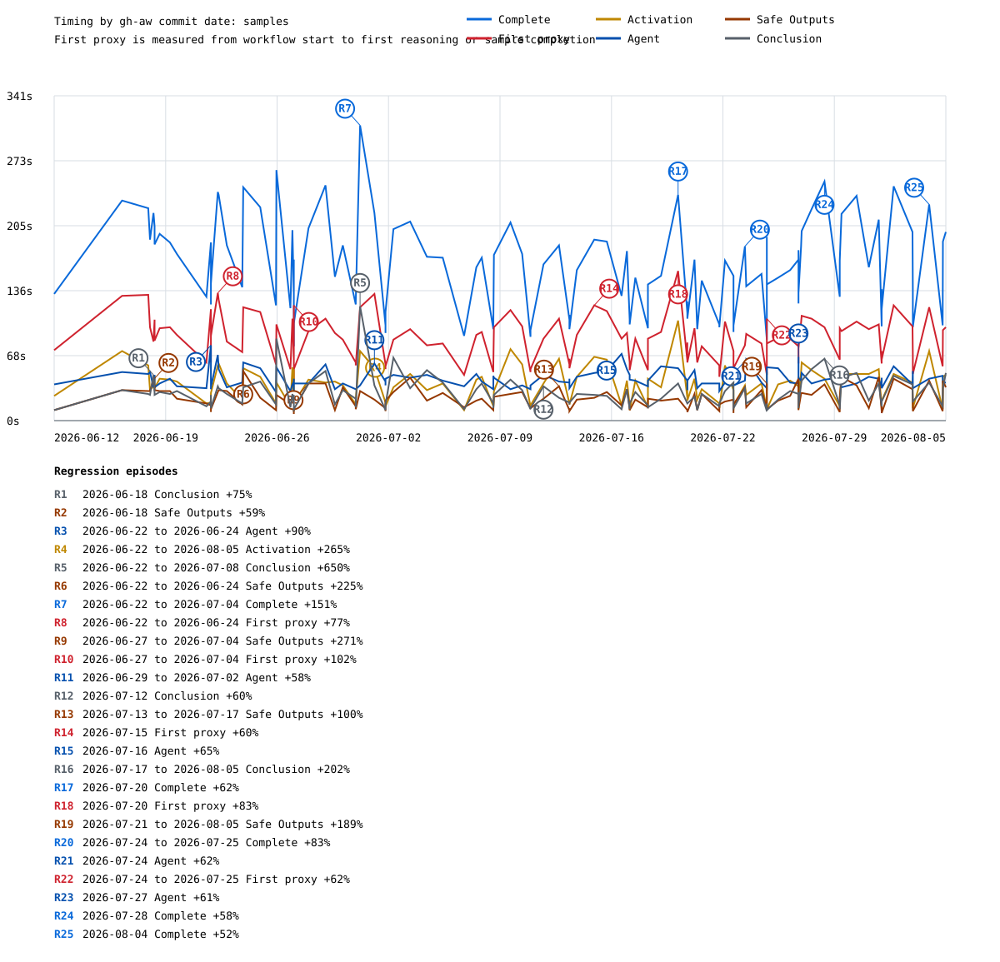
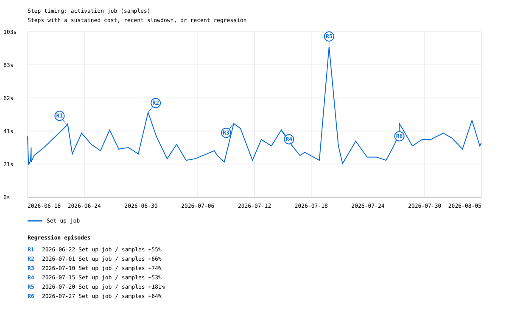
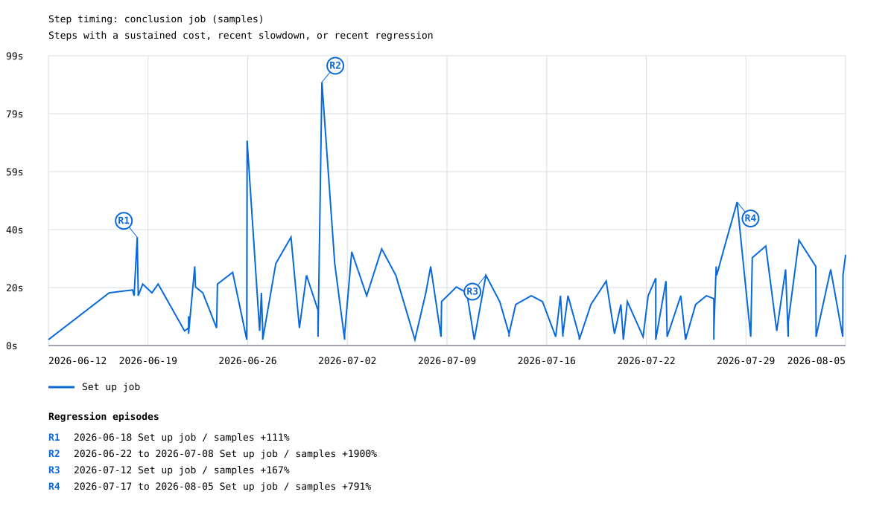
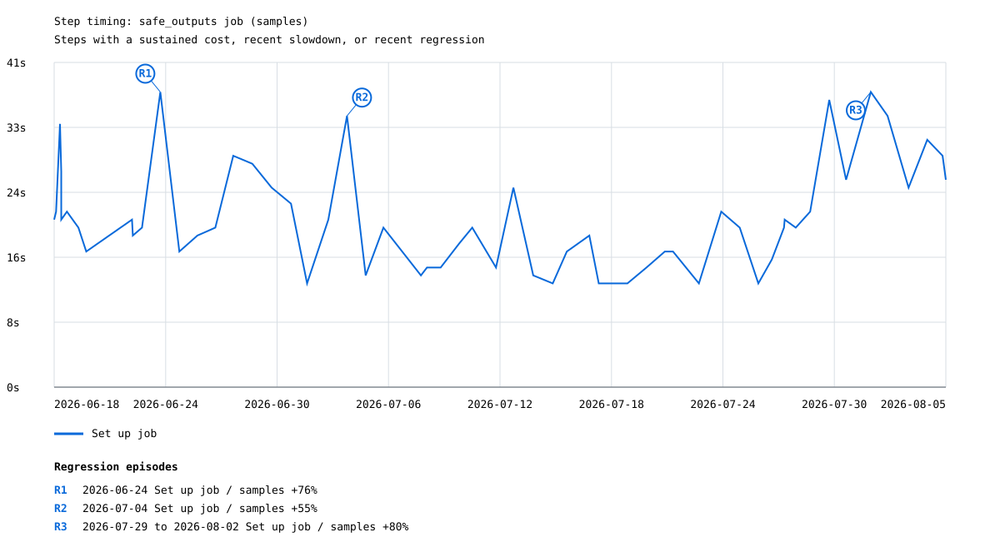

# Copilot create-issue timing

Analyzed **229** successful agent runs: **70 inference** and **159 samples**.

| Metric | Samples | Median | P90 | Min | Max |
|---|---:|---:|---:|---:|---:|
| Time to complete | 229 | 184.0s | 362.4s | 78.0s | 517.0s |
| Time to first reasoning/sample proxy | 224 | 98.0s | 143.5s | 41.0s | 197.4s |

The x-axis is the commit time of the resolved gh-aw commit, not the workflow run time. Inference and deterministic sample runs are graphed separately.

## Inference timing

## Sample timing

## Candidate regressions

Found **214 threshold crossings** grouped into **51 episodes**. Baselines are calculated separately for inference and sample runs; each `R#` labels the largest increase in an episode whose crossings are no more than three gh-aw commit-days apart.

| Label | Episode | Mode | Metric | Peak | Prior median | Increase | Run | gh-aw version / commit |
|---|---|---|---|---:|---:|---:|---|---|
| R1 | 2026-06-18 to 2026-06-25 (6 points) | inference | Activation | 50.0s | 13.0s | 285% | [#138](https://github.com/githubnext/gh-aw-test/actions/runs/27728784857) | `v0.80.3-6-g6be6637234-dirty` / `6be6637234c7` |
| R2 | 2026-06-18 to 2026-06-22 (7 points) | inference | Conclusion | 38.0s | 9.0s | 322% | [#145](https://github.com/githubnext/gh-aw-test/actions/runs/27805721716) | `393419b2fb` / `393419b2fbab` |
| R3 | 2026-06-18 to 2026-06-21 (4 points) | inference | Safe Outputs | 35.0s | 14.0s | 150% | [#148](https://github.com/githubnext/gh-aw-test/actions/runs/27860318787) | `9ad5040c3f` / `9ad5040c3f6f` |
| R4 | 2026-06-18 to 2026-06-20 (3 points) | inference | Complete | 292.0s | 184.0s | 59% | [#145](https://github.com/githubnext/gh-aw-test/actions/runs/27805721716) | `393419b2fb` / `393419b2fbab` |
| R5 | 2026-06-18 (1 point) | samples | Conclusion | 48.0s | 27.5s | 75% | [#142](https://github.com/githubnext/gh-aw-test/actions/runs/27787448695) | `v0.80.4-42-g5c1590bc9c` / `5c1590bc9c0b` |
| R6 | 2026-06-18 (1 point) | samples | Safe Outputs | 43.0s | 27.0s | 59% | [#142](https://github.com/githubnext/gh-aw-test/actions/runs/27787448695) | `v0.80.4-42-g5c1590bc9c` / `5c1590bc9c0b` |
| R7 | 2026-06-22 to 2026-06-24 (3 points) | samples | Agent | 79.0s | 41.5s | 90% | [#158](https://github.com/githubnext/gh-aw-test/actions/runs/27980997744) | `v0.80.9` / `a3624368c4e7` |
| R8 | 2026-06-22 (1 point) | inference | First proxy | 182.8s | 115.9s | 58% | [#153](https://github.com/githubnext/gh-aw-test/actions/runs/27966398112) | `42a1743825` / `42a1743825aa` |
| R9 | 2026-06-22 to 2026-08-05 (43 points) | samples | Activation | 73.0s | 20.0s | 265% | [#184](https://github.com/githubnext/gh-aw-test/actions/runs/28493889040) | `a146daa7e6` / `a146daa7e61e` |
| R10 | 2026-06-22 to 2026-07-08 (15 points) | samples | Conclusion | 120.0s | 16.0s | 650% | [#184](https://github.com/githubnext/gh-aw-test/actions/runs/28493889040) | `a146daa7e6` / `a146daa7e61e` |
| R11 | 2026-06-22 to 2026-06-24 (4 points) | samples | Safe Outputs | 52.0s | 16.0s | 225% | [#164](https://github.com/githubnext/gh-aw-test/actions/runs/28078251384) | `5373e080d7` / `5373e080d733` |
| R12 | 2026-06-22 to 2026-07-04 (12 points) | samples | Complete | 310.0s | 123.5s | 151% | [#184](https://github.com/githubnext/gh-aw-test/actions/runs/28493889040) | `a146daa7e6` / `a146daa7e61e` |
| R13 | 2026-06-22 to 2026-06-24 (3 points) | samples | First proxy | 134.0s | 75.5s | 77% | [#154](https://github.com/githubnext/gh-aw-test/actions/runs/27969702756) | `efe940eb13` / `efe940eb13d0` |
| R14 | 2026-06-25 (1 point) | inference | Safe Outputs | 51.0s | 27.5s | 85% | [#295](https://github.com/githubnext/gh-aw-test/actions/runs/32516874360) | `v0.81.3-44-g42b108eaae` / `42b108eaae3a` |
| R15 | 2026-06-27 to 2026-07-04 (7 points) | samples | Safe Outputs | 39.0s | 10.5s | 271% | [#175](https://github.com/githubnext/gh-aw-test/actions/runs/28311501615) | `2d16c282d0` / `2d16c282d0fa` |
| R16 | 2026-06-27 to 2026-07-04 (9 points) | samples | First proxy | 121.0s | 60.0s | 102% | [#207](https://github.com/githubnext/gh-aw-test/actions/runs/28994888262) | `v0.81.6` / `eed4304d8740` |
| R17 | 2026-06-29 to 2026-07-02 (2 points) | samples | Agent | 60.0s | 38.0s | 58% | [#187](https://github.com/githubnext/gh-aw-test/actions/runs/28565506990) | `588de5c52d` / `588de5c52dff` |
| R18 | 2026-06-29 to 2026-07-03 (5 points) | inference | Agent | 191.0s | 88.0s | 117% | [#300](https://github.com/githubnext/gh-aw-test/actions/runs/32521125135) | `v0.82.1` / `b5fdd698c629` |
| R19 | 2026-06-29 (1 point) | inference | Safe Outputs | 76.0s | 30.0s | 153% | [#299](https://github.com/githubnext/gh-aw-test/actions/runs/32520135455) | `v0.82.0-41-g663ad7b5aa` / `663ad7b5aa7c` |
| R20 | 2026-07-02 to 2026-07-03 (2 points) | inference | Conclusion | 60.0s | 32.5s | 85% | [#303](https://github.com/githubnext/gh-aw-test/actions/runs/32525853446) | `v0.82.2-48-g332d5e24d2` / `332d5e24d2c6` |
| R21 | 2026-07-08 to 2026-07-09 (2 points) | inference | Activation | 93.0s | 44.5s | 109% | [#308](https://github.com/githubnext/gh-aw-test/actions/runs/32531331276) | `v0.82.6-11-gbd5467ff41` / `bd5467ff4106` |
| R22 | 2026-07-12 (1 point) | samples | Conclusion | 36.0s | 22.5s | 60% | [#215](https://github.com/githubnext/gh-aw-test/actions/runs/29179483580) | `bc7d2db69a` / `bc7d2db69a21` |
| R23 | 2026-07-12 (1 point) | inference | Safe Outputs | 60.0s | 33.0s | 82% | [#312](https://github.com/githubnext/gh-aw-test/actions/runs/32534604788) | `v0.82.8-28-ge0a0e5d23d` / `e0a0e5d23d0e` |
| R24 | 2026-07-13 to 2026-07-17 (3 points) | samples | Safe Outputs | 36.0s | 18.0s | 100% | [#218](https://github.com/githubnext/gh-aw-test/actions/runs/29223659614) | `fe2174281f` / `fe2174281f75` |
| R25 | 2026-07-14 (1 point) | inference | Activation | 104.0s | 50.5s | 106% | [#314](https://github.com/githubnext/gh-aw-test/actions/runs/32536396153) | `v0.82.9-54-gdf13f08917` / `df13f0891719` |
| R26 | 2026-07-14 (1 point) | inference | First proxy | 197.4s | 127.3s | 55% | [#314](https://github.com/githubnext/gh-aw-test/actions/runs/32536396153) | `v0.82.9-54-gdf13f08917` / `df13f0891719` |
| R27 | 2026-07-15 (2 points) | samples | First proxy | 121.0s | 75.5s | 60% | [#224](https://github.com/githubnext/gh-aw-test/actions/runs/29388180753) | `61336cb2af` / `61336cb2af49` |
| R28 | 2026-07-15 to 2026-07-17 (2 points) | inference | Conclusion | 82.0s | 40.5s | 102% | [#315](https://github.com/githubnext/gh-aw-test/actions/runs/32537059340) | `v0.82.9-134-gf0a3dd21c6` / `f0a3dd21c6e5` |
| R29 | 2026-07-16 (1 point) | samples | Agent | 70.0s | 42.5s | 65% | [#232](https://github.com/githubnext/gh-aw-test/actions/runs/29555946105) | `v0.82.11` / `38e22c4075e3` |
| R30 | 2026-07-16 to 2026-07-18 (3 points) | inference | Detection | 169.0s | 67.5s | 150% | [#317](https://github.com/githubnext/gh-aw-test/actions/runs/32538498682) | `v0.82.12-7-gc096ffebd2` / `c096ffebd27f` |
| R31 | 2026-07-17 to 2026-08-05 (22 points) | samples | Conclusion | 65.0s | 21.5s | 202% | [#270](https://github.com/githubnext/gh-aw-test/actions/runs/30421452781) | `acc797bbab` / `acc797bbab36` |
| R32 | 2026-07-20 (1 point) | samples | Complete | 237.0s | 146.5s | 62% | [#239](https://github.com/githubnext/gh-aw-test/actions/runs/29716703808) | `7bdc455764` / `7bdc455764ae` |
| R33 | 2026-07-20 (1 point) | samples | First proxy | 157.0s | 86.0s | 83% | [#239](https://github.com/githubnext/gh-aw-test/actions/runs/29716703808) | `7bdc455764` / `7bdc455764ae` |
| R34 | 2026-07-21 to 2026-08-05 (17 points) | samples | Safe Outputs | 39.0s | 13.5s | 189% | [#268](https://github.com/githubnext/gh-aw-test/actions/runs/30329600083) | `v0.83.3` / `7e728ffd6fc9` |
| R35 | 2026-07-21 (1 point) | inference | Safe Outputs | 67.0s | 36.0s | 86% | [#321](https://github.com/githubnext/gh-aw-test/actions/runs/32540903699) | `v0.82.15-23-g2a7ac3d34e` / `2a7ac3d34e2d` |
| R36 | 2026-07-24 to 2026-07-25 (3 points) | samples | Complete | 183.0s | 100.0s | 83% | [#252](https://github.com/githubnext/gh-aw-test/actions/runs/30066002900) | `755ee4dea3` / `755ee4dea341` |
| R37 | 2026-07-24 (1 point) | samples | Agent | 64.0s | 39.5s | 62% | [#257](https://github.com/githubnext/gh-aw-test/actions/runs/30144752865) | `v0.83.2` / `56a38be41a18` |
| R38 | 2026-07-24 to 2026-07-25 (2 points) | samples | First proxy | 107.0s | 66.0s | 62% | [#268](https://github.com/githubnext/gh-aw-test/actions/runs/30329600083) | `v0.83.3` / `7e728ffd6fc9` |
| R39 | 2026-07-25 to 2026-07-26 (2 points) | inference | Activation | 92.0s | 45.0s | 104% | [#325](https://github.com/githubnext/gh-aw-test/actions/runs/32542948173) | `v0.83.3-17-g11d9ea9de7` / `11d9ea9de729` |
| R40 | 2026-07-25 (1 point) | inference | Safe Outputs | 75.0s | 36.5s | 105% | [#325](https://github.com/githubnext/gh-aw-test/actions/runs/32542948173) | `v0.83.3-17-g11d9ea9de7` / `11d9ea9de729` |
| R41 | 2026-07-27 (1 point) | samples | Agent | 67.0s | 41.5s | 61% | [#269](https://github.com/githubnext/gh-aw-test/actions/runs/30330754586) | `v0.83.4` / `bbb804287845` |
| R42 | 2026-07-28 (1 point) | samples | Complete | 251.0s | 159.0s | 58% | [#270](https://github.com/githubnext/gh-aw-test/actions/runs/30421452781) | `acc797bbab` / `acc797bbab36` |
| R43 | 2026-07-30 (1 point) | inference | Conclusion | 57.0s | 37.0s | 54% | [#330](https://github.com/githubnext/gh-aw-test/actions/runs/32545622744) | `v0.84.0-61-g5adcdb6d4e` / `5adcdb6d4ec1` |
| R44 | 2026-08-01 to 2026-08-03 (2 points) | inference | Safe Outputs | 142.0s | 46.5s | 205% | [#334](https://github.com/githubnext/gh-aw-test/actions/runs/32547543586) | `v0.84.3-58-g53baccde53` / `53baccde5390` |
| R45 | 2026-08-02 (1 point) | inference | Conclusion | 70.0s | 43.0s | 63% | [#333](https://github.com/githubnext/gh-aw-test/actions/runs/32547123314) | `v0.84.2-95-gf5bd99245e` / `f5bd99245e40` |
| R46 | 2026-08-03 (1 point) | inference | Activation | 87.0s | 56.0s | 55% | [#334](https://github.com/githubnext/gh-aw-test/actions/runs/32547543586) | `v0.84.3-58-g53baccde53` / `53baccde5390` |
| R47 | 2026-08-03 (1 point) | inference | Complete | 517.0s | 318.0s | 63% | [#334](https://github.com/githubnext/gh-aw-test/actions/runs/32547543586) | `v0.84.3-58-g53baccde53` / `53baccde5390` |
| R48 | 2026-08-04 (1 point) | samples | Complete | 227.0s | 149.5s | 52% | [#288](https://github.com/githubnext/gh-aw-test/actions/runs/30876764168) | `021887f5dc` / `021887f5dce3` |
| R49 | 2026-08-08 (1 point) | inference | Activation | 102.0s | 50.0s | 104% | [#341](https://github.com/githubnext/gh-aw-test/actions/runs/32552452139) | `v0.86.1-57-gba0a9f9589` / `ba0a9f958976` |
| R50 | 2026-08-14 to 2026-08-17 (3 points) | inference | Safe Outputs | 78.0s | 37.5s | 108% | [#349](https://github.com/githubnext/gh-aw-test/actions/runs/32556073604) | `v0.86.2-73-gc35faf436c` / `c35faf436c79` |
| R51 | 2026-08-17 (1 point) | inference | Activation | 68.0s | 45.0s | 51% | [#352](https://github.com/githubnext/gh-aw-test/actions/runs/32558234273) | `v0.87.0-133-g2b2cf3fb01` / `2b2cf3fb01ee` |

## Job and major steps

| Job or step | Samples | Median | P90 |
|---|---:|---:|---:|
| Workflow start to proxy step | 229 | 94.0s | 127.0s |
| Proxy step to reasoning/sample proxy | 224 | 0.0s | 23.7s |
| Agent job | 229 | 47.0s | 107.2s |
| Execute GitHub Copilot CLI | 70 | 30.0s | 114.1s |
| Detection job | 69 | 70.0s | 88.4s |
| Install ripgrep | 6 | 14.0s | 19.0s |
| Download container images | 229 | 10.0s | 16.0s |
| Set up job | 216 | 7.0s | 19.0s |
| Start MCP Gateway | 229 | 7.0s | 11.2s |
| Install GitHub Copilot CLI | 229 | 4.0s | 5.0s |
| Upload agent artifacts | 56 | 2.0s | 2.0s |
| Setup Scripts | 212 | 2.0s | 4.0s |
| Download activation artifact | 82 | 2.0s | 2.0s |
| Install AWF binary | 13 | 2.0s | 2.0s |
| Checkout repository | 26 | 2.0s | 2.0s |
| Stop MCP Gateway | 25 | 2.0s | 2.0s |
| Print firewall logs | 1 | 2.0s | 2.0s |
| Audit pre-agent workspace | 1 | 2.0s | 2.0s |

## Step timing by job

A step is included within a mode when its overall median exceeds 10 seconds, its median over the latest five observations exceeds 10 seconds (with at least three observations), or one of its latest five observations is a regression of at least 50% and 10 seconds against the preceding median. Exact job and step names define each series, so renamed steps begin or end naturally.

### Inference step graphs

#### activation

| Step | Selection signal | Timed occurrences | Over 10s | Median | P90 |
|---|---|---:|---:|---:|---:|
| Set up job | overall median >10s, recent median >10s, recent regression | 70 | 94% | 31.0s | 54.1s |

#### agent

| Step | Selection signal | Timed occurrences | Over 10s | Median | P90 |
|---|---|---:|---:|---:|---:|
| Download container images | overall median >10s | 70 | 66% | 11.0s | 18.1s |
| Execute GitHub Copilot CLI | overall median >10s, recent median >10s | 70 | 100% | 30.0s | 114.1s |
| Install ripgrep | overall median >10s, recent median >10s | 6 | 67% | 14.0s | 19.0s |
| Set up job | overall median >10s, recent median >10s | 70 | 81% | 17.0s | 22.0s |

#### conclusion

| Step | Selection signal | Timed occurrences | Over 10s | Median | P90 |
|---|---|---:|---:|---:|---:|
| Set up job | overall median >10s, recent median >10s, recent regression | 70 | 94% | 25.5s | 41.0s |
| Upload usage artifact | recent regression | 65 | 2% | 1.0s | 2.0s |

#### detection

| Step | Selection signal | Timed occurrences | Over 10s | Median | P90 |
|---|---|---:|---:|---:|---:|
| Execute GitHub Copilot CLI | overall median >10s, recent median >10s, recent regression | 67 | 100% | 28.0s | 36.0s |
| Execute threat detection with AWF | overall median >10s | 2 | 100% | 40.5s | 42.5s |
| Install GitHub Copilot CLI | recent median >10s | 69 | 6% | 4.0s | 5.6s |
| Set up job | overall median >10s, recent median >10s | 69 | 78% | 17.0s | 21.2s |

#### safe_outputs

| Step | Selection signal | Timed occurrences | Over 10s | Median | P90 |
|---|---|---:|---:|---:|---:|
| Set up job | overall median >10s, recent median >10s | 70 | 94% | 28.0s | 42.9s |

### Samples step graphs

#### activation

| Step | Selection signal | Timed occurrences | Over 10s | Median | P90 |
|---|---|---:|---:|---:|---:|
| Set up job | recent median >10s, recent regression | 159 | 50% | 10.0s | 38.0s |

#### conclusion

| Step | Selection signal | Timed occurrences | Over 10s | Median | P90 |
|---|---|---:|---:|---:|---:|
| Set up job | recent median >10s, recent regression | 159 | 48% | 6.0s | 27.2s |

#### safe_outputs

| Step | Selection signal | Timed occurrences | Over 10s | Median | P90 |
|---|---|---:|---:|---:|---:|
| Set up job | recent median >10s, recent regression | 159 | 48% | 7.0s | 25.0s |

## Method

Only overall-successful `workflow_dispatch` runs with a successful `agent` job are included. Inference runs require a successful `Execute GitHub Copilot CLI` step; sample runs require a successful deterministic replay step. Time to complete is `run.updated_at - run.run_started_at`. The first-proxy metric is end to end from `run.run_started_at`. For inference, its endpoint is the first timestamped assistant/reasoning event or agent-originated `tools/call`; for samples, it is deterministic replay completion. Detection is the standalone `detection` job duration and is present only for non-sample runs. Step durations come directly from the GitHub Actions jobs API (`completed_at - started_at`) for successful steps in successful jobs. Runs without resolvable gh-aw commit dates remain in CSV/JSON but are omitted from the time-axis graphs.
