# Performance history for `copilot-create-issue.md`

## Run, job & step times (`main`, using inference)

**137 successful runs.** Regressions shown below are limited to the last six weeks.

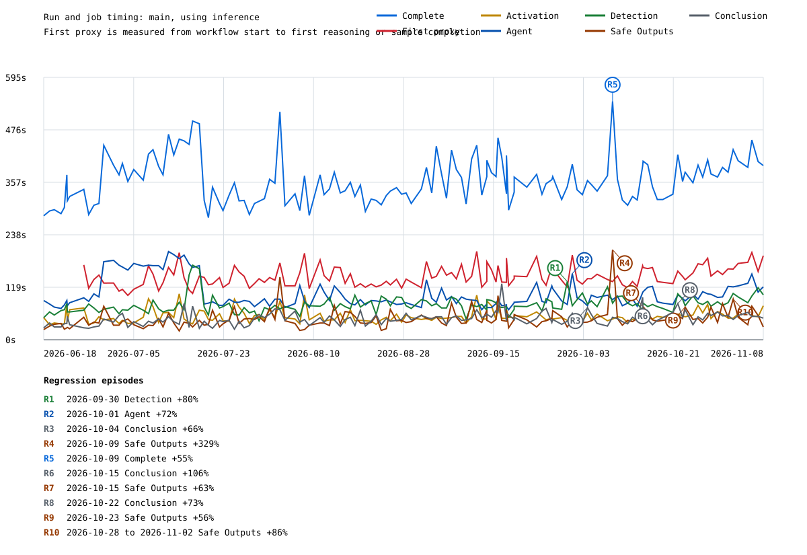

| Run or job | Samples | Median | P90 |
|---|---:|---:|---:|
| Workflow complete | 137 | 355.0s | 431.0s |
| Workflow start to proxy step | 137 | 116.0s | 148.4s |
| Proxy step to first reasoning/sample | 129 | 22.0s | 31.3s |
| Copilot phase — AWF startup | 129 | 14.4s | 21.9s |
| Copilot phase — harness startup | 129 | 2.2s | 6.8s |
| Copilot phase — Copilot process | 129 | 6.2s | 9.2s |
| Job `activation` | 137 | 50.0s | 72.8s |
| Job `agent` | 137 | 90.0s | 165.8s |
| Job `detection` | 137 | 77.0s | 98.4s |
| Job `safe_outputs` | 137 | 43.0s | 72.8s |
| Job `conclusion` | 137 | 46.0s | 65.0s |
| Major step `Execute GitHub Copilot CLI` | 137 | 28.0s | 112.0s |
| Major step `Set up job` | 137 | 18.0s | 22.4s |
| Major step `Install ripgrep` | 6 | 14.0s | 19.0s |
| Major step `Download container images` | 137 | 11.0s | 18.0s |
| Major step `Start MCP Gateway` | 137 | 6.0s | 11.4s |
| Major step `Install GitHub Copilot CLI` | 137 | 4.0s | 12.4s |
| Major step `Setup Scripts` | 136 | 3.0s | 5.0s |
| Major step `Download activation artifact` | 55 | 2.0s | 2.0s |
| Major step `Upload agent artifacts` | 39 | 2.0s | 2.0s |
| Major step `Checkout repository` | 27 | 2.0s | 3.0s |
| Major step `Install AWF binary` | 17 | 2.0s | 13.0s |
| Major step `Stop MCP Gateway` | 17 | 2.0s | 2.0s |
| Major step `Print firewall logs` | 2 | 2.0s | 2.0s |
| Major step `Audit pre-agent workspace` | 1 | 2.0s | 2.0s |
| Major step `Upload agent output fallback artifact` | 6 | 2.0s | 2.0s |
| Major step `Checkout repository (gh-aw default)` | 4 | 2.0s | 2.0s |
| Major step `Redact secrets in logs` | 2 | 2.0s | 2.0s |

### Major step times for job `activation` (`main`, using inference)

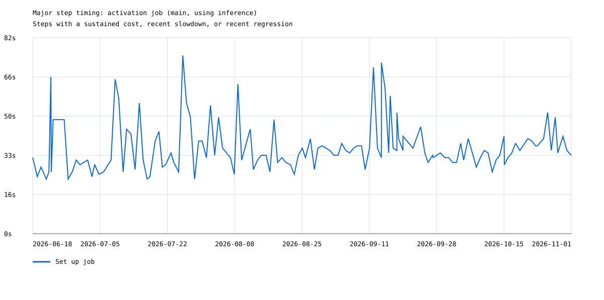

#### Candidate regressions (last six weeks)

No candidate regressions in the last six weeks.

### Major step times for job `agent` (`main`, using inference)

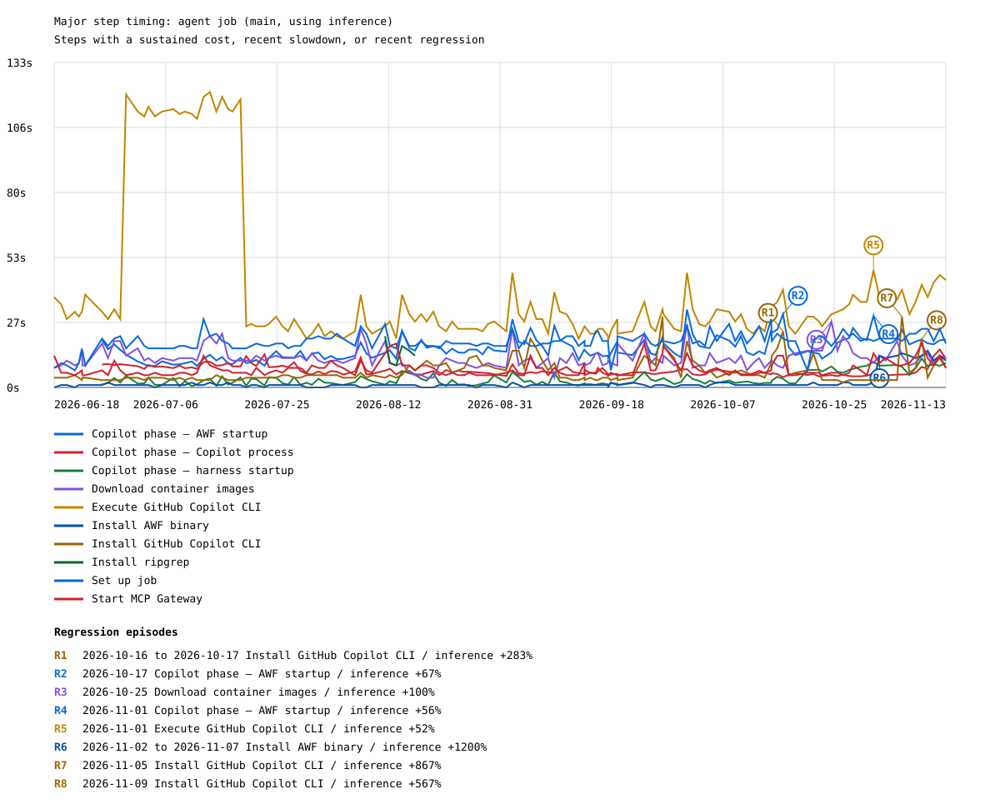

#### Candidate regressions (last six weeks)

| Label | Episode | Step | Peak | Prior median | Increase | Run | gh-aw version / commit |
|---|---|---|---:|---:|---:|---|---|
| R1 | 2026-09-27 | Install GitHub Copilot CLI | 29.0s | 4.0s | 625% | [#572](https://github.com/githubnext/gh-aw-test/actions/runs/36290978751) | `ba0499c5a4` / `ba0499c5a462` |
| R2 | 2026-09-27 | Start MCP Gateway | 17.0s | 5.5s | 209% | [#576](https://github.com/githubnext/gh-aw-test/actions/runs/36373361100) | `60ff367876` / `60ff367876c6` |
| R3 | 2026-10-01 | Copilot phase — AWF startup | 31.9s | 14.1s | 125% | [#588](https://github.com/githubnext/gh-aw-test/actions/runs/36810119640) | `55f35d4bdf` / `55f35d4bdfbc` |
| R4 | 2026-10-01 | Download container images | 26.0s | 10.5s | 148% | [#588](https://github.com/githubnext/gh-aw-test/actions/runs/36810119640) | `55f35d4bdf` / `55f35d4bdfbc` |
| R5 | 2026-10-01 | Execute GitHub Copilot CLI | 47.0s | 24.5s | 92% | [#588](https://github.com/githubnext/gh-aw-test/actions/runs/36810119640) | `55f35d4bdf` / `55f35d4bdfbc` |
| R6 | 2026-10-16 to 2026-10-17 | Install GitHub Copilot CLI | 23.0s | 6.0s | 283% | [#658](https://github.com/githubnext/gh-aw-test/actions/runs/38997993206) | `d3915e4a21` / `d3915e4a2104` |
| R7 | 2026-10-17 | Copilot phase — AWF startup | 30.0s | 18.0s | 67% | [#658](https://github.com/githubnext/gh-aw-test/actions/runs/38997993206) | `d3915e4a21` / `d3915e4a2104` |
| R8 | 2026-10-25 | Download container images | 27.0s | 13.5s | 100% | [#695](https://github.com/githubnext/gh-aw-test/actions/runs/40157645986) | `2301a1bb74` / `2301a1bb74f2` |
| R9 | 2026-11-01 | Copilot phase — AWF startup | 29.4s | 18.9s | 56% | [#723](https://github.com/githubnext/gh-aw-test/actions/runs/41268861095) | `6cf066f682` / `6cf066f6821a` |
| R10 | 2026-11-01 | Execute GitHub Copilot CLI | 48.0s | 31.5s | 52% | [#723](https://github.com/githubnext/gh-aw-test/actions/runs/41268861095) | `6cf066f682` / `6cf066f6821a` |
| R11 | 2026-11-02 to 2026-11-05 | Install AWF binary | 13.0s | 1.0s | 1200% | [#727](https://github.com/githubnext/gh-aw-test/actions/runs/41381991056) | `110ad53df6` / `110ad53df63c` |
| R12 | 2026-11-05 | Install GitHub Copilot CLI | 29.0s | 3.0s | 867% | [#738](https://github.com/githubnext/gh-aw-test/actions/runs/42155182196) | `f7b1cc2c3a` / `f7b1cc2c3a7a` |

### Major step times for job `detection` (`main`, using inference)

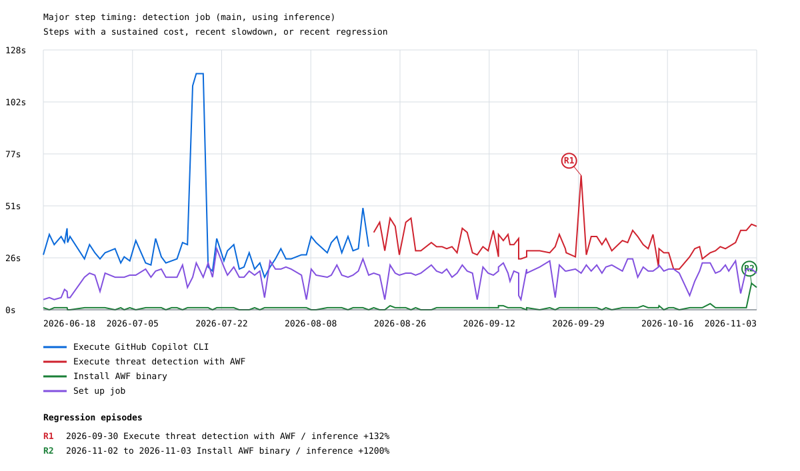

#### Candidate regressions (last six weeks)

| Label | Episode | Step | Peak | Prior median | Increase | Run | gh-aw version / commit |
|---|---|---|---:|---:|---:|---|---|
| R1 | 2026-09-30 | Execute threat detection with AWF | 66.0s | 28.5s | 132% | [#584](https://github.com/githubnext/gh-aw-test/actions/runs/36663803035) | `03b8f74820` / `03b8f7482069` |
| R2 | 2026-09-30 | Install GitHub Copilot CLI | 24.0s | 6.0s | 300% | [#584](https://github.com/githubnext/gh-aw-test/actions/runs/36663803035) | `03b8f74820` / `03b8f7482069` |
| R3 | 2026-10-03 | Install GitHub Copilot CLI | 26.0s | 8.0s | 225% | [#596](https://github.com/githubnext/gh-aw-test/actions/runs/37093124717) | `fe02b64412` / `fe02b644122e` |
| R4 | 2026-10-11 | Install GitHub Copilot CLI | 22.0s | 10.0s | 120% | [#627](https://github.com/githubnext/gh-aw-test/actions/runs/38108164405) | `a1376acf2e` / `a1376acf2ead` |
| R5 | 2026-10-22 | Install GitHub Copilot CLI | 24.0s | 7.5s | 220% | [#679](https://github.com/githubnext/gh-aw-test/actions/runs/39715911390) | `2b01e8ed2a` / `2b01e8ed2a27` |
| R6 | 2026-11-02 to 2026-11-05 | Install AWF binary | 13.0s | 1.0s | 1200% | [#727](https://github.com/githubnext/gh-aw-test/actions/runs/41381991056) | `110ad53df6` / `110ad53df63c` |

### Major step times for job `safe_outputs` (`main`, using inference)

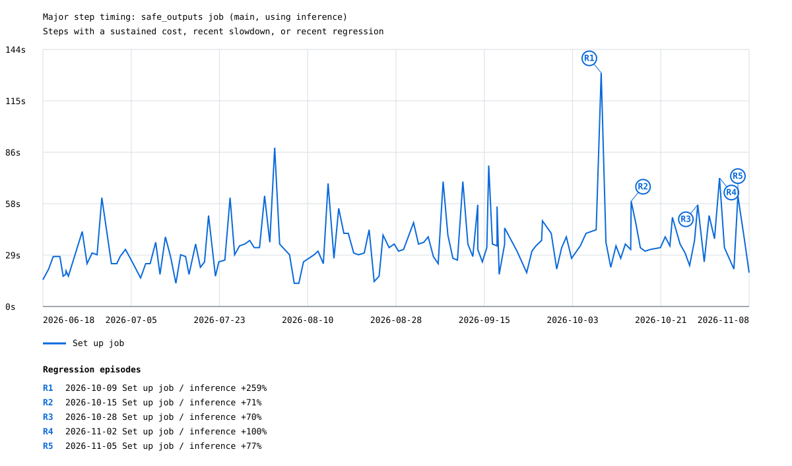

#### Candidate regressions (last six weeks)

| Label | Episode | Step | Peak | Prior median | Increase | Run | gh-aw version / commit |
|---|---|---|---:|---:|---:|---|---|
| R1 | 2026-10-09 | Set up job | 131.0s | 36.5s | 259% | [#619](https://github.com/githubnext/gh-aw-test/actions/runs/37878870672) | `c268866353` / `c2688663530a` |
| R2 | 2026-10-09 | Setup Scripts | 59.0s | 3.5s | 1586% | [#619](https://github.com/githubnext/gh-aw-test/actions/runs/37878870672) | `c268866353` / `c2688663530a` |
| R3 | 2026-10-15 | Set up job | 59.0s | 34.5s | 71% | [#649](https://github.com/githubnext/gh-aw-test/actions/runs/38685973796) | `5eb4c298ec` / `5eb4c298ecba` |
| R4 | 2026-10-28 | Set up job | 57.0s | 33.5s | 70% | [#711](https://github.com/githubnext/gh-aw-test/actions/runs/40810886681) | `0bb0365790` / `0bb036579091` |
| R5 | 2026-11-02 | Set up job | 72.0s | 36.0s | 100% | [#727](https://github.com/githubnext/gh-aw-test/actions/runs/41381991056) | `110ad53df6` / `110ad53df63c` |
| R6 | 2026-11-05 | Set up job | 62.0s | 35.0s | 77% | [#738](https://github.com/githubnext/gh-aw-test/actions/runs/42155182196) | `f7b1cc2c3a` / `f7b1cc2c3a7a` |

### Major step times for job `conclusion` (`main`, using inference)

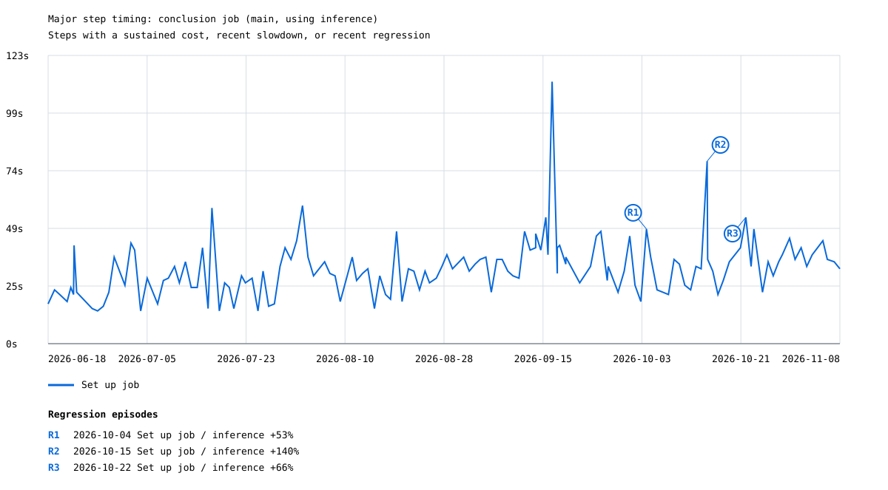

#### Candidate regressions (last six weeks)

| Label | Episode | Step | Peak | Prior median | Increase | Run | gh-aw version / commit |
|---|---|---|---:|---:|---:|---|---|
| R1 | 2026-10-04 | Set up job | 49.0s | 32.0s | 53% | [#599](https://github.com/githubnext/gh-aw-test/actions/runs/37176542463) | `054871a707` / `054871a7076b` |
| R2 | 2026-10-15 | Set up job | 78.0s | 32.5s | 140% | [#645](https://github.com/githubnext/gh-aw-test/actions/runs/38675409397) | `e7bc6056a7` / `e7bc6056a784` |
| R3 | 2026-10-22 | Set up job | 54.0s | 32.5s | 66% | [#679](https://github.com/githubnext/gh-aw-test/actions/runs/39715911390) | `2b01e8ed2a` / `2b01e8ed2a27` |

## Run, job & step times (`released`, using inference)

**36 successful runs.** Regressions shown below are limited to the last six weeks.

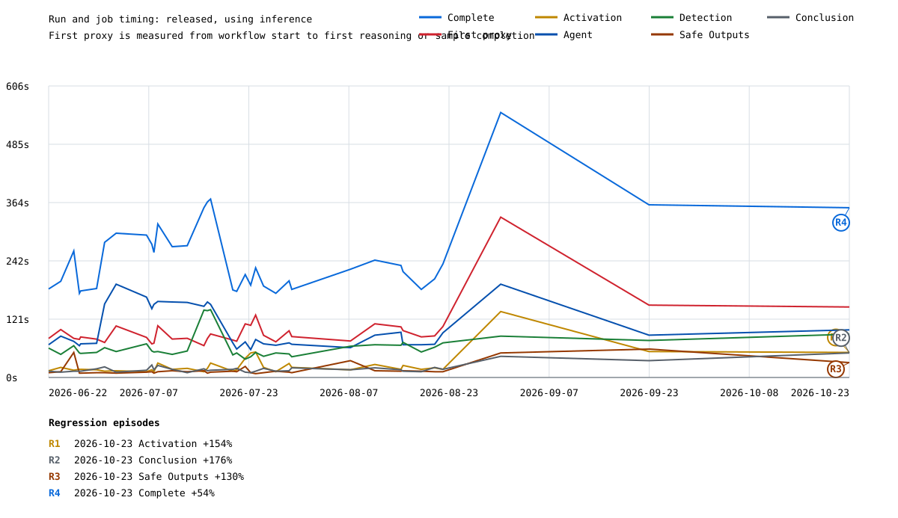

| Run or job | Samples | Median | P90 |
|---|---:|---:|---:|
| Workflow complete | 36 | 230.5s | 356.0s |
| Workflow start to proxy step | 36 | 64.0s | 98.0s |
| Proxy step to first reasoning/sample | 36 | 21.4s | 28.5s |
| Copilot phase — AWF startup | 36 | 13.5s | 18.4s |
| Copilot phase — harness startup | 36 | 2.2s | 5.5s |
| Copilot phase — Copilot process | 36 | 7.7s | 8.8s |
| Job `activation` | 36 | 17.0s | 51.5s |
| Job `agent` | 36 | 82.5s | 157.5s |
| Job `detection` | 36 | 54.5s | 88.0s |
| Job `safe_outputs` | 36 | 12.0s | 33.0s |
| Job `conclusion` | 36 | 16.0s | 25.5s |
| Major step `Execute GitHub Copilot CLI` | 36 | 29.5s | 115.5s |
| Major step `Download container images` | 36 | 12.0s | 18.0s |
| Major step `Install ripgrep` | 3 | 12.0s | 14.4s |
| Major step `Start MCP Gateway` | 36 | 6.0s | 9.5s |
| Major step `Install GitHub Copilot CLI` | 36 | 4.0s | 9.5s |
| Major step `Set up job` | 34 | 3.0s | 4.7s |
| Major step `Setup Scripts` | 35 | 3.0s | 4.0s |
| Major step `Stop MCP Gateway` | 6 | 2.0s | 2.0s |
| Major step `Install AWF binary` | 3 | 2.0s | 2.0s |
| Major step `Download activation artifact` | 11 | 2.0s | 2.0s |
| Major step `Upload agent artifacts` | 8 | 2.0s | 2.0s |
| Major step `Checkout repository` | 11 | 2.0s | 2.0s |
| Major step `Upload agent output fallback artifact` | 1 | 2.0s | 2.0s |

### Major step times for job `activation` (`released`, using inference)

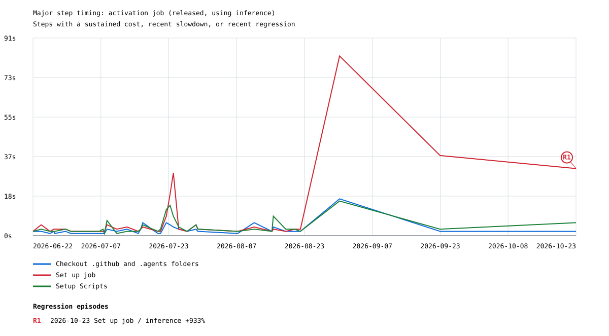

#### Candidate regressions (last six weeks)

| Label | Episode | Step | Peak | Prior median | Increase | Run | gh-aw version / commit |
|---|---|---|---:|---:|---:|---|---|
| R1 | 2026-10-23 | Set up job | 31.0s | 3.0s | 933% | [#691](https://github.com/githubnext/gh-aw-test/actions/runs/40057619697) | `v0.93.3` / `317d9005a6bc` |

### Major step times for job `agent` (`released`, using inference)

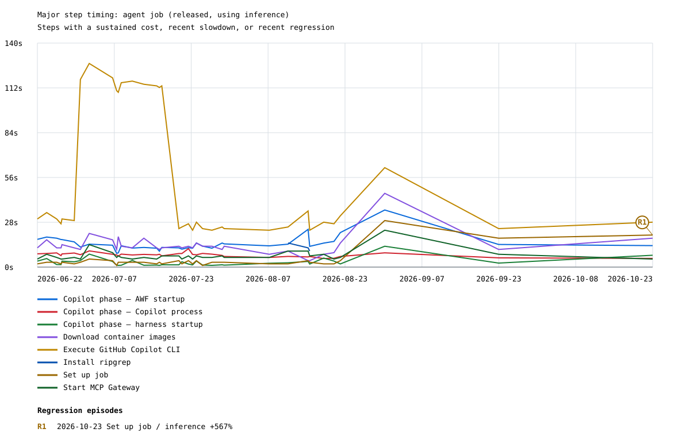

#### Candidate regressions (last six weeks)

| Label | Episode | Step | Peak | Prior median | Increase | Run | gh-aw version / commit |
|---|---|---|---:|---:|---:|---|---|
| R1 | 2026-10-23 | Set up job | 20.0s | 3.0s | 567% | [#691](https://github.com/githubnext/gh-aw-test/actions/runs/40057619697) | `v0.93.3` / `317d9005a6bc` |

### Major step times for job `detection` (`released`, using inference)

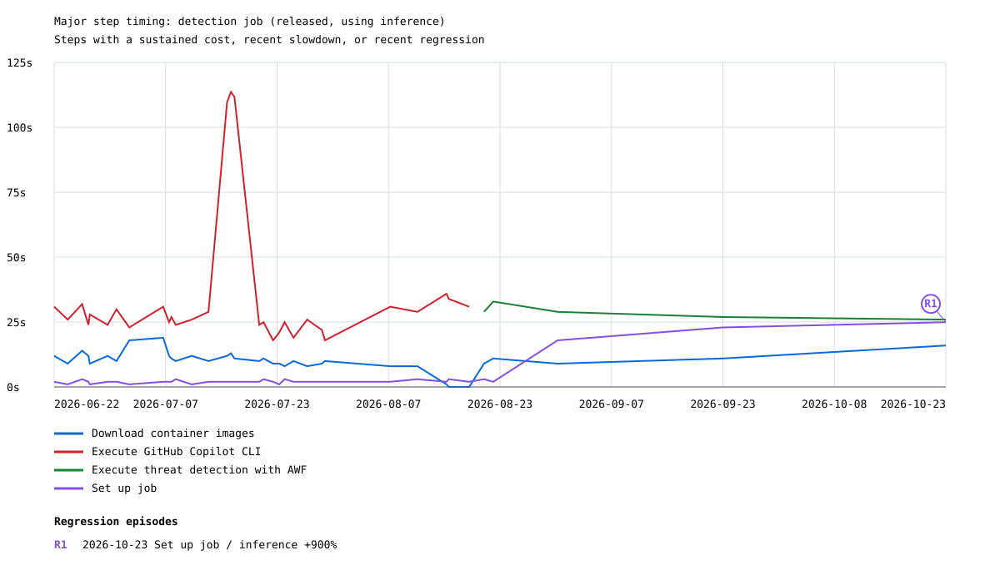

#### Candidate regressions (last six weeks)

| Label | Episode | Step | Peak | Prior median | Increase | Run | gh-aw version / commit |
|---|---|---|---:|---:|---:|---|---|
| R1 | 2026-10-23 | Set up job | 25.0s | 2.5s | 900% | [#691](https://github.com/githubnext/gh-aw-test/actions/runs/40057619697) | `v0.93.3` / `317d9005a6bc` |

### Major step times for job `safe_outputs` (`released`, using inference)

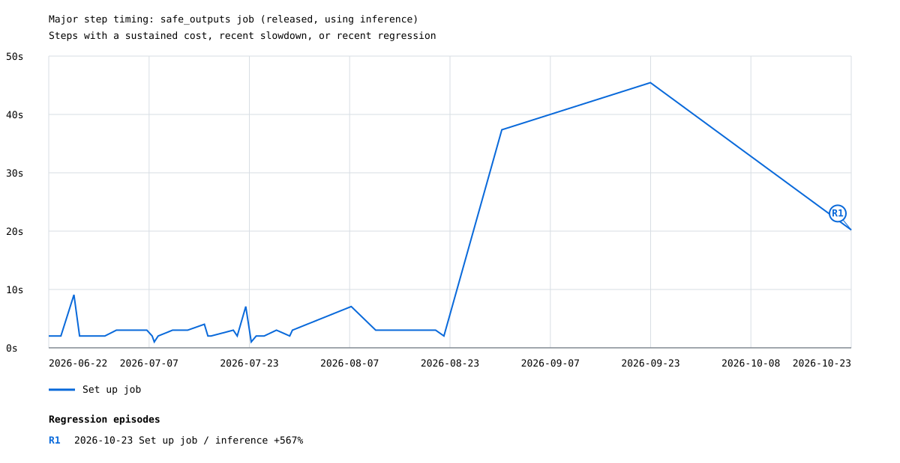

#### Candidate regressions (last six weeks)

| Label | Episode | Step | Peak | Prior median | Increase | Run | gh-aw version / commit |
|---|---|---|---:|---:|---:|---|---|
| R1 | 2026-10-23 | Set up job | 20.0s | 3.0s | 567% | [#691](https://github.com/githubnext/gh-aw-test/actions/runs/40057619697) | `v0.93.3` / `317d9005a6bc` |

### Major step times for job `conclusion` (`released`, using inference)

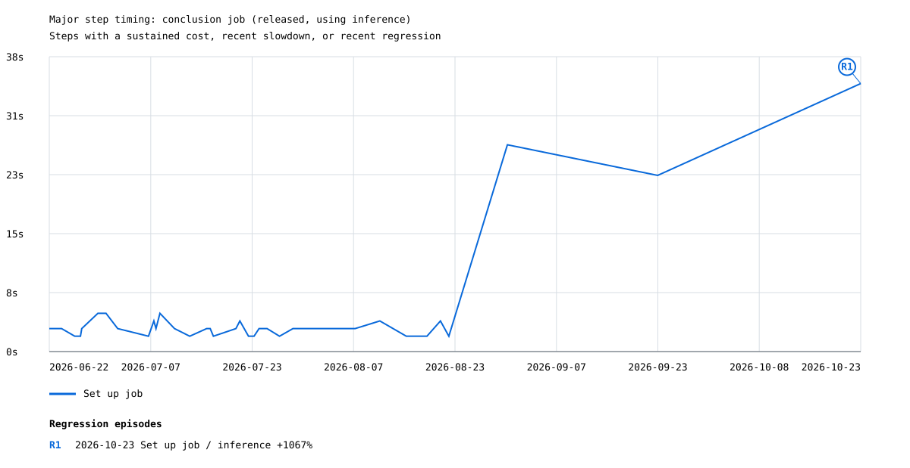

#### Candidate regressions (last six weeks)

| Label | Episode | Step | Peak | Prior median | Increase | Run | gh-aw version / commit |
|---|---|---|---:|---:|---:|---|---|
| R1 | 2026-10-23 | Set up job | 35.0s | 3.0s | 1067% | [#691](https://github.com/githubnext/gh-aw-test/actions/runs/40057619697) | `v0.93.3` / `317d9005a6bc` |

## Run, job & step times (`main`, using samples)

**130 successful runs.** Regressions shown below are limited to the last six weeks.

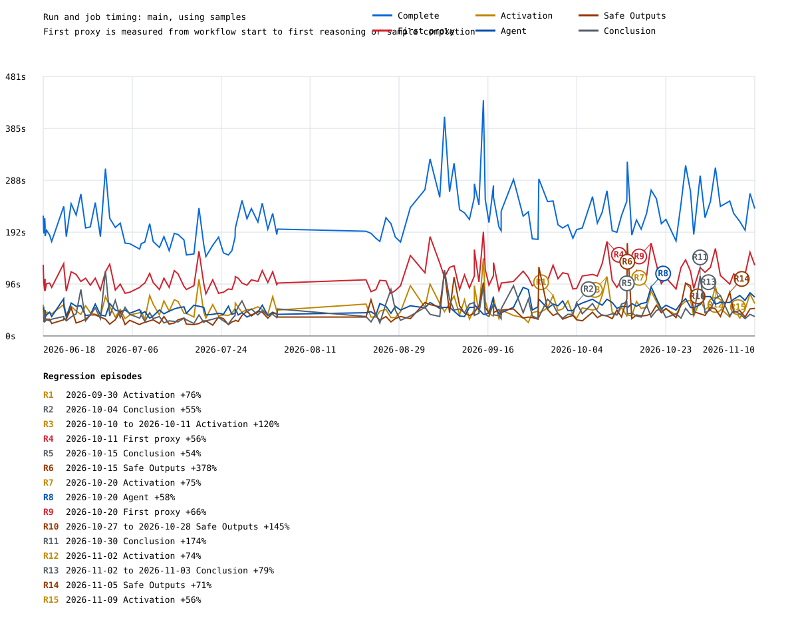

| Run or job | Samples | Median | P90 |
|---|---:|---:|---:|
| Workflow complete | 130 | 210.5s | 271.8s |
| Workflow start to proxy step | 130 | 103.0s | 133.1s |
| Proxy step to first reasoning/sample | 130 | 0.0s | 1.0s |
| Job `activation` | 130 | 47.0s | 73.0s |
| Job `agent` | 130 | 51.0s | 65.3s |
| Job `detection` | 0 | n/a | n/a |
| Job `safe_outputs` | 130 | 36.0s | 58.0s |
| Job `conclusion` | 130 | 39.5s | 66.2s |
| Major step `Download container images` | 130 | 10.0s | 15.1s |
| Major step `Set up job` | 130 | 9.0s | 15.0s |
| Major step `Start MCP Gateway` | 130 | 6.0s | 11.0s |
| Major step `Print firewall logs` | 1 | 5.0s | 5.0s |
| Major step `Install GitHub Copilot CLI` | 130 | 4.0s | 11.0s |
| Major step `Setup Scripts` | 129 | 3.0s | 6.0s |
| Major step `Checkout repository` | 26 | 2.0s | 3.0s |
| Major step `Install AWF binary` | 10 | 2.0s | 12.1s |
| Major step `Download activation artifact` | 44 | 2.0s | 2.0s |
| Major step `Upload agent artifacts` | 25 | 2.0s | 2.0s |
| Major step `Stop MCP Gateway` | 22 | 2.0s | 2.0s |
| Major step `Upload agent output fallback artifact` | 9 | 2.0s | 2.0s |
| Major step `Checkout repository (gh-aw default)` | 8 | 2.0s | 2.0s |

### Major step times for job `activation` (`main`, using samples)

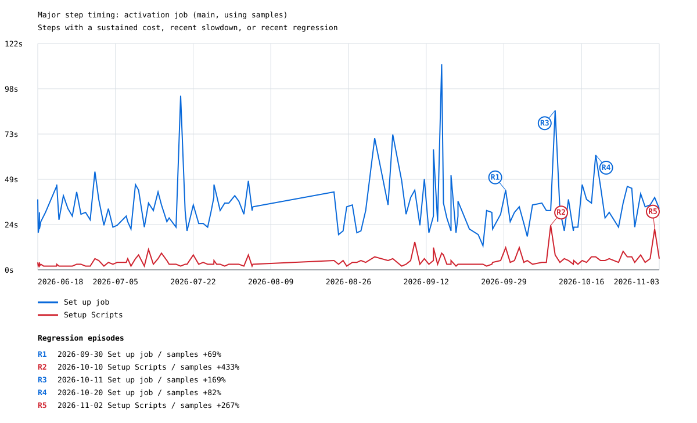

#### Candidate regressions (last six weeks)

| Label | Episode | Step | Peak | Prior median | Increase | Run | gh-aw version / commit |
|---|---|---|---:|---:|---:|---|---|
| R1 | 2026-09-30 | Set up job | 43.0s | 25.5s | 69% | [#585](https://github.com/githubnext/gh-aw-test/actions/runs/36664634145) | `03b8f74820` / `03b8f7482069` |
| R2 | 2026-10-10 | Setup Scripts | 24.0s | 4.5s | 433% | [#624](https://github.com/githubnext/gh-aw-test/actions/runs/38020774086) | `6976a375a2` / `6976a375a288` |
| R3 | 2026-10-11 | Set up job | 86.0s | 32.0s | 169% | [#628](https://github.com/githubnext/gh-aw-test/actions/runs/38108788934) | `a1376acf2e` / `a1376acf2ead` |
| R4 | 2026-10-20 | Set up job | 62.0s | 34.0s | 82% | [#671](https://github.com/githubnext/gh-aw-test/actions/runs/39365173077) | `7363a87ff2` / `7363a87ff248` |
| R5 | 2026-11-02 | Setup Scripts | 22.0s | 6.0s | 267% | [#728](https://github.com/githubnext/gh-aw-test/actions/runs/41383278858) | `110ad53df6` / `110ad53df63c` |

### Major step times for job `agent` (`main`, using samples)

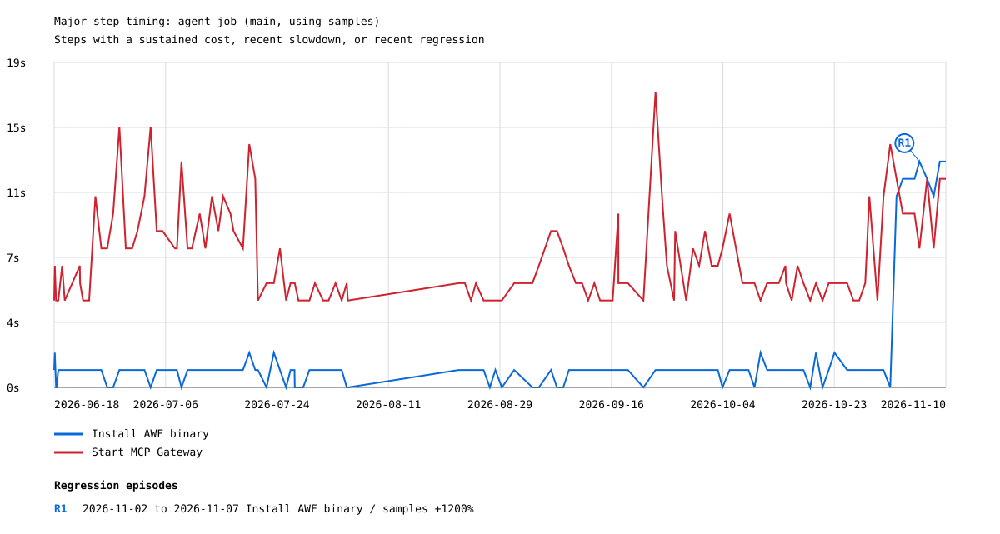

#### Candidate regressions (last six weeks)

| Label | Episode | Step | Peak | Prior median | Increase | Run | gh-aw version / commit |
|---|---|---|---:|---:|---:|---|---|
| R1 | 2026-09-27 | Install GitHub Copilot CLI | 14.0s | 4.0s | 250% | [#577](https://github.com/githubnext/gh-aw-test/actions/runs/36374032160) | `60ff367876` / `60ff367876c6` |
| R2 | 2026-10-08 | Set up job | 20.0s | 10.0s | 100% | [#616](https://github.com/githubnext/gh-aw-test/actions/runs/37723139085) | `23403d903f` / `23403d903f5c` |
| R3 | 2026-10-20 | Download container images | 27.0s | 11.0s | 145% | [#671](https://github.com/githubnext/gh-aw-test/actions/runs/39365173077) | `7363a87ff2` / `7363a87ff248` |
| R4 | 2026-10-20 | Set up job | 21.0s | 11.0s | 91% | [#671](https://github.com/githubnext/gh-aw-test/actions/runs/39365173077) | `7363a87ff2` / `7363a87ff248` |
| R5 | 2026-10-21 | Install GitHub Copilot CLI | 17.0s | 7.0s | 143% | [#675](https://github.com/githubnext/gh-aw-test/actions/runs/39538801637) | `15d31e5375` / `15d31e5375b6` |
| R6 | 2026-10-31 | Set up job | 19.0s | 9.0s | 111% | [#720](https://github.com/githubnext/gh-aw-test/actions/runs/41164565470) | `f5d4768eda` / `f5d4768eda57` |
| R7 | 2026-11-02 to 2026-11-05 | Install AWF binary | 13.0s | 1.0s | 1200% | [#739](https://github.com/githubnext/gh-aw-test/actions/runs/42156621046) | `f7b1cc2c3a` / `f7b1cc2c3a7a` |

### Major step times for job `detection` (`main`, using samples)

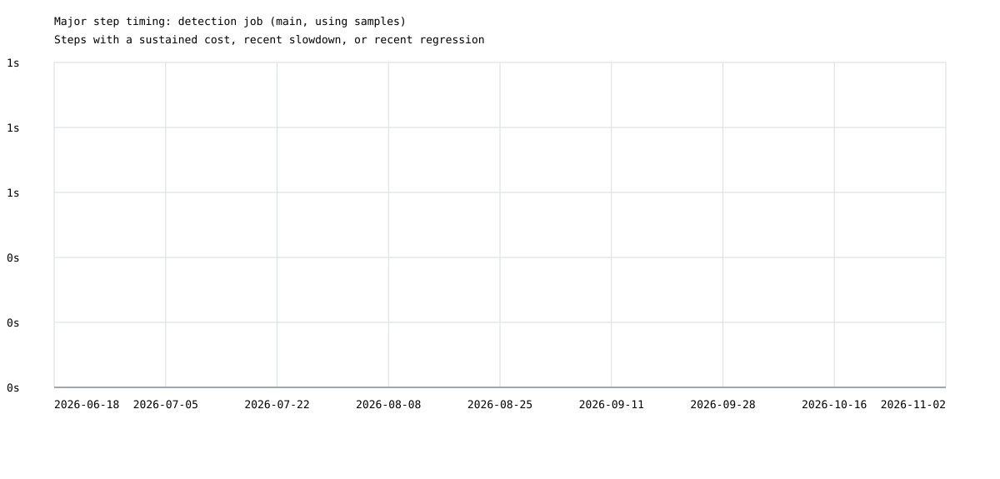

#### Candidate regressions (last six weeks)

No candidate regressions in the last six weeks.

### Major step times for job `safe_outputs` (`main`, using samples)

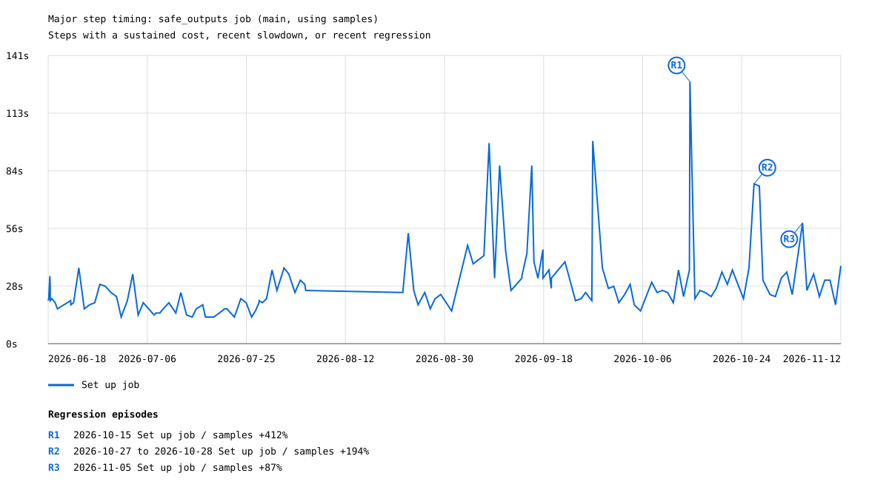

#### Candidate regressions (last six weeks)

| Label | Episode | Step | Peak | Prior median | Increase | Run | gh-aw version / commit |
|---|---|---|---:|---:|---:|---|---|
| R1 | 2026-09-27 | Set up job | 99.0s | 29.5s | 236% | [#577](https://github.com/githubnext/gh-aw-test/actions/runs/36374032160) | `60ff367876` / `60ff367876c6` |
| R2 | 2026-09-27 | Setup Scripts | 18.0s | 4.0s | 350% | [#577](https://github.com/githubnext/gh-aw-test/actions/runs/36374032160) | `60ff367876` / `60ff367876c6` |
| R3 | 2026-10-15 | Set up job | 128.0s | 25.0s | 412% | [#650](https://github.com/githubnext/gh-aw-test/actions/runs/38687065162) | `5eb4c298ec` / `5eb4c298ecba` |
| R4 | 2026-10-15 | Setup Scripts | 33.0s | 5.0s | 560% | [#650](https://github.com/githubnext/gh-aw-test/actions/runs/38687065162) | `5eb4c298ec` / `5eb4c298ecba` |
| R5 | 2026-10-27 to 2026-10-28 | Set up job | 78.0s | 26.5s | 194% | [#704](https://github.com/githubnext/gh-aw-test/actions/runs/40444485731) | `6c387d00c7` / `6c387d00c750` |
| R6 | 2026-11-05 | Set up job | 59.0s | 31.5s | 87% | [#735](https://github.com/githubnext/gh-aw-test/actions/runs/41961481939) | `0aa2738ed8` / `0aa2738ed88d` |

### Major step times for job `conclusion` (`main`, using samples)

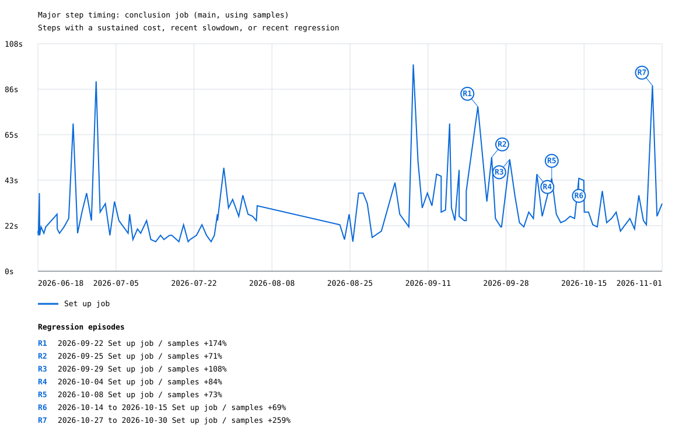

#### Candidate regressions (last six weeks)

| Label | Episode | Step | Peak | Prior median | Increase | Run | gh-aw version / commit |
|---|---|---|---:|---:|---:|---|---|
| R1 | 2026-09-29 | Set up job | 53.0s | 25.5s | 108% | [#581](https://github.com/githubnext/gh-aw-test/actions/runs/36517314719) | `09e40b7fb1` / `09e40b7fb1d4` |
| R2 | 2026-10-04 | Set up job | 46.0s | 25.0s | 84% | [#604](https://github.com/githubnext/gh-aw-test/actions/runs/37259935923) | `a5e1584ee9` / `a5e1584ee9ac` |
| R3 | 2026-10-08 | Set up job | 44.0s | 25.5s | 73% | [#616](https://github.com/githubnext/gh-aw-test/actions/runs/37723139085) | `23403d903f` / `23403d903f5c` |
| R4 | 2026-10-14 to 2026-10-15 | Set up job | 44.0s | 26.0s | 69% | [#640](https://github.com/githubnext/gh-aw-test/actions/runs/38506297635) | `d06e0878f2` / `d06e0878f2b7` |
| R5 | 2026-10-27 to 2026-10-30 | Set up job | 88.0s | 24.5s | 259% | [#716](https://github.com/githubnext/gh-aw-test/actions/runs/40997496546) | `0c48a3354d` / `0c48a3354d11` |
| R6 | 2026-11-02 to 2026-11-03 | Set up job | 54.0s | 25.5s | 112% | [#728](https://github.com/githubnext/gh-aw-test/actions/runs/41383278858) | `110ad53df6` / `110ad53df63c` |
| R7 | 2026-11-03 | Setup Scripts | 21.0s | 5.0s | 320% | [#731](https://github.com/githubnext/gh-aw-test/actions/runs/41571985205) | `b5b1bf7df7` / `b5b1bf7df754` |

## Run, job & step times (`released`, using samples)

**239 successful runs.** Regressions shown below are limited to the last six weeks.

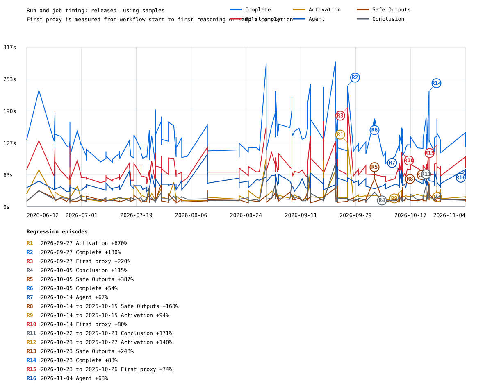

| Run or job | Samples | Median | P90 |
|---|---:|---:|---:|
| Workflow complete | 239 | 125.0s | 171.6s |
| Workflow start to proxy step | 239 | 68.0s | 96.2s |
| Proxy step to first reasoning/sample | 239 | 0.0s | 1.0s |
| Job `activation` | 239 | 18.0s | 35.2s |
| Job `agent` | 239 | 44.0s | 62.0s |
| Job `detection` | 0 | n/a | n/a |
| Job `safe_outputs` | 239 | 13.0s | 23.0s |
| Job `conclusion` | 239 | 16.0s | 26.2s |
| Major step `Download container images` | 239 | 10.0s | 19.0s |
| Major step `Install ripgrep` | 8 | 9.0s | 18.0s |
| Major step `Start MCP Gateway` | 239 | 7.0s | 12.0s |
| Major step `Install GitHub Copilot CLI` | 238 | 4.0s | 12.0s |
| Major step `Set up job` | 201 | 3.0s | 4.0s |
| Major step `Setup Scripts` | 225 | 2.0s | 4.0s |
| Major step `Install AWF binary` | 22 | 2.0s | 2.9s |
| Major step `Download activation artifact` | 80 | 2.0s | 2.0s |
| Major step `Upload agent artifacts` | 48 | 2.0s | 2.0s |
| Major step `Stop MCP Gateway` | 28 | 2.0s | 2.0s |
| Major step `Checkout repository` | 33 | 2.0s | 3.0s |
| Major step `Upload agent output fallback artifact` | 14 | 2.0s | 2.0s |
| Major step `Checkout repository (gh-aw default)` | 5 | 2.0s | 2.0s |
| Major step `Redact secrets in logs` | 2 | 2.0s | 2.0s |

### Major step times for job `activation` (`released`, using samples)

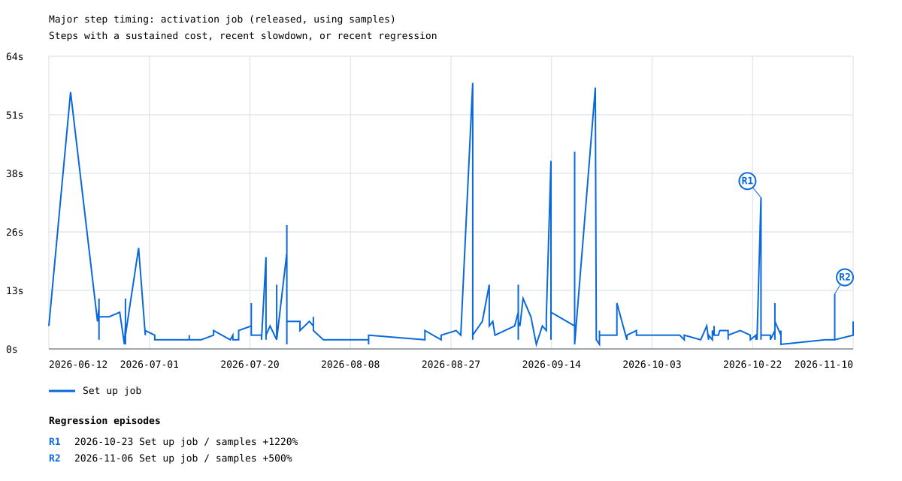

#### Candidate regressions (last six weeks)

| Label | Episode | Step | Peak | Prior median | Increase | Run | gh-aw version / commit |
|---|---|---|---:|---:|---:|---|---|
| R1 | 2026-09-27 | Checkout .github and .agents folders | 21.0s | 2.0s | 950% | [#579](https://github.com/githubnext/gh-aw-test/actions/runs/36383138156) | `v0.89.22` / `60480baa868f` |
| R2 | 2026-09-27 | Setup Scripts | 64.0s | 2.0s | 3100% | [#579](https://github.com/githubnext/gh-aw-test/actions/runs/36383138156) | `v0.89.22` / `60480baa868f` |
| R3 | 2026-10-23 | Set up job | 33.0s | 2.5s | 1220% | [#692](https://github.com/githubnext/gh-aw-test/actions/runs/40058412852) | `v0.93.3` / `317d9005a6bc` |
| R4 | 2026-10-27 | Setup Scripts | 14.0s | 4.0s | 250% | [#722](https://github.com/githubnext/gh-aw-test/actions/runs/41172355892) | `v1.0.1` / `0627fdbe4beb` |

### Major step times for job `agent` (`released`, using samples)

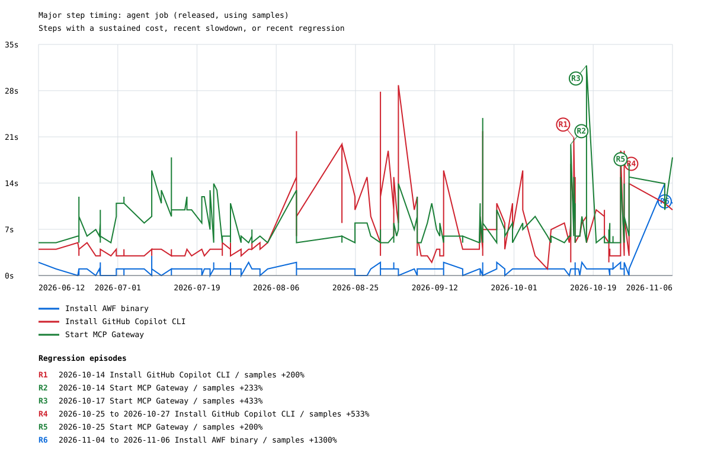

#### Candidate regressions (last six weeks)

| Label | Episode | Step | Peak | Prior median | Increase | Run | gh-aw version / commit |
|---|---|---|---:|---:|---:|---|---|
| R1 | 2026-10-14 | Install GitHub Copilot CLI | 21.0s | 7.0s | 200% | [#648](https://github.com/githubnext/gh-aw-test/actions/runs/38683926531) | `v0.91.14` / `667d4531279b` |
| R2 | 2026-10-14 | Start MCP Gateway | 20.0s | 6.0s | 233% | [#651](https://github.com/githubnext/gh-aw-test/actions/runs/38692101200) | `v0.91.12` / `5708fc68e91f` |
| R3 | 2026-10-17 | Download container images | 27.0s | 10.5s | 157% | [#669](https://github.com/githubnext/gh-aw-test/actions/runs/39203708774) | `v0.92.5` / `cbc32699c3d6` |
| R4 | 2026-10-17 | Start MCP Gateway | 32.0s | 6.0s | 433% | [#673](https://github.com/githubnext/gh-aw-test/actions/runs/39375395453) | `v0.92.5` / `cbc32699c3d6` |
| R5 | 2026-10-22 | Download container images | 26.0s | 16.0s | 62% | [#701](https://github.com/githubnext/gh-aw-test/actions/runs/40269048729) | `v0.93.1` / `310317364125` |
| R6 | 2026-10-23 | Set up job | 13.0s | 2.0s | 550% | [#692](https://github.com/githubnext/gh-aw-test/actions/runs/40058412852) | `v0.93.3` / `317d9005a6bc` |
| R7 | 2026-10-25 to 2026-10-26 | Install GitHub Copilot CLI | 19.0s | 3.0s | 533% | [#709](https://github.com/githubnext/gh-aw-test/actions/runs/40631906382) | `v0.93.5` / `32ecafbc061c` |
| R8 | 2026-10-25 | Start MCP Gateway | 15.0s | 5.0s | 200% | [#709](https://github.com/githubnext/gh-aw-test/actions/runs/40631906382) | `v0.93.5` / `32ecafbc061c` |
| R9 | 2026-11-04 | Install AWF binary | 14.0s | 1.0s | 1300% | [#737](https://github.com/githubnext/gh-aw-test/actions/runs/41973253286) | `v1.2.0` / `18928ba35b7e` |

### Major step times for job `detection` (`released`, using samples)

#### Candidate regressions (last six weeks)

No candidate regressions in the last six weeks.

### Major step times for job `safe_outputs` (`released`, using samples)

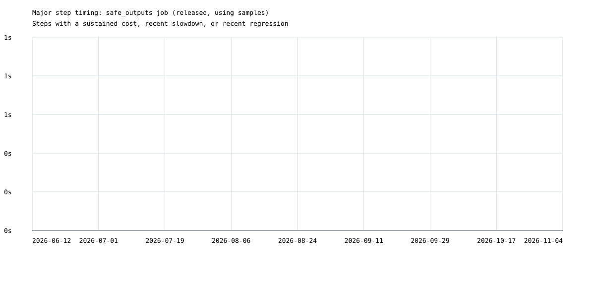

#### Candidate regressions (last six weeks)

| Label | Episode | Step | Peak | Prior median | Increase | Run | gh-aw version / commit |
|---|---|---|---:|---:|---:|---|---|
| R1 | 2026-10-05 | Setup Scripts | 38.0s | 2.0s | 1800% | [#610](https://github.com/githubnext/gh-aw-test/actions/runs/37417069047) | `v0.91.0` / `af1e2fd1ef1e` |
| R2 | 2026-10-15 | Setup Scripts | 18.0s | 4.0s | 350% | [#672](https://github.com/githubnext/gh-aw-test/actions/runs/39369618109) | `v0.92.0` / `a68f5a9436d2` |
| R3 | 2026-10-23 | Set up job | 26.0s | 3.0s | 767% | [#692](https://github.com/githubnext/gh-aw-test/actions/runs/40058412852) | `v0.93.3` / `317d9005a6bc` |
| R4 | 2026-10-23 | Setup Scripts | 13.0s | 3.0s | 333% | [#692](https://github.com/githubnext/gh-aw-test/actions/runs/40058412852) | `v0.93.3` / `317d9005a6bc` |

### Major step times for job `conclusion` (`released`, using samples)

#### Candidate regressions (last six weeks)

| Label | Episode | Step | Peak | Prior median | Increase | Run | gh-aw version / commit |
|---|---|---|---:|---:|---:|---|---|
| R1 | 2026-10-05 | Setup Scripts | 13.0s | 2.0s | 550% | [#610](https://github.com/githubnext/gh-aw-test/actions/runs/37417069047) | `v0.91.0` / `af1e2fd1ef1e` |
| R2 | 2026-10-22 to 2026-10-23 | Set up job | 29.0s | 3.0s | 867% | [#692](https://github.com/githubnext/gh-aw-test/actions/runs/40058412852) | `v0.93.3` / `317d9005a6bc` |
| R3 | 2026-10-22 | Setup Scripts | 15.0s | 3.0s | 400% | [#686](https://github.com/githubnext/gh-aw-test/actions/runs/39910702968) | `v0.93.1` / `310317364125` |

## Method

Each section fixes both independent dimensions: gh-aw source (`main` or combined stable/pre-release `released`) and execution mode (`inference` or `samples`). Only overall-successful `workflow_dispatch` runs with a successful `agent` job are included. Candidate regression baselines use up to ten preceding observations from the same section and step; displayed regression episodes are limited to the six weeks before report generation. A step is graphed when it has a sustained cost, recent slowdown, or recent regression. Runs with missing compiler metadata remain in CSV/JSON but are excluded from graphs.

For inference runs, `Execute GitHub Copilot CLI` is additionally split using timestamped runtime markers: **AWF startup** is step start to the AWF agent-container entrypoint, **harness startup** is that entrypoint to the first Copilot process start, and **Copilot process** is the first process start through the final process close (including retries and retry delays). Cleanup after process close remains visible only in the full step duration, while unavailable markers produce no phase value.
